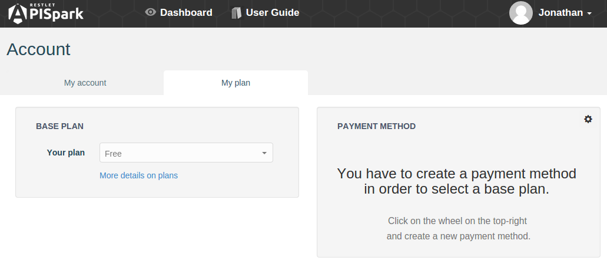

# Sign Up to APISpark

APISpark's sign up process is straightforward. It relies on social login to make signing up as simple as possible for you.

To sign up, click on the **Sign in** button from the [welcome page](https://apispark.com/ "Welcome page")  and pick a social provider to identify yourself with. Your account will automatically be created for you.

Several social login providers are supported, including **GitHub**, **Google**, **Windows Live**, **Yahoo**, and **Facebook**. You can create an account for free with any of these providers if you don't already own one.

If you are not already logged-in to your chosen provider, you will be asked to enter your username and password.

# The Account page

All your APISpark account details are available on the **Account** page.

To navigate to the **Account** page, make sure you are signed in, then click on your username on top right of your screen and select **My account**.

The **Account** page has two main tabs: **My account** and **My plan**.

## My account

 * The **Information** section provides information about your profile and the social network account you use to connect to APISpark  
 * The **Tokens** section lists the tokens linked to your account.
You won't need to use these tokens for now. You can simply sign in to APISpark with your social provider account.  
 * The **Access Log** section logs your account activity.

## My plan

From this tab, you can select the plan that best suits you. You may upgrade or downgrade your plan according to your needs.

The **My plan** tab also provides management of you **Payment Method**.
