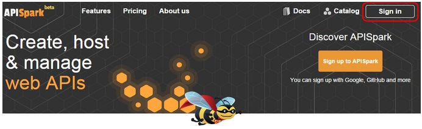
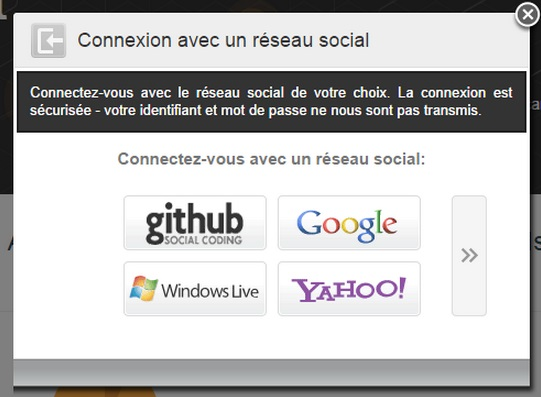
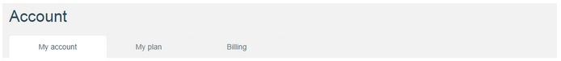
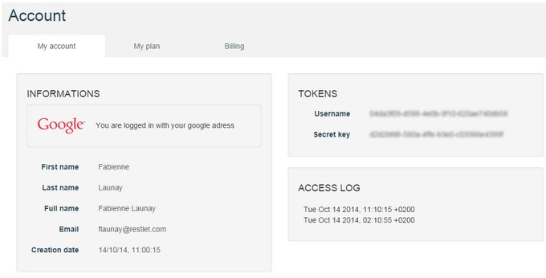
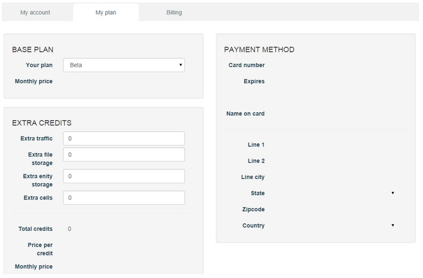
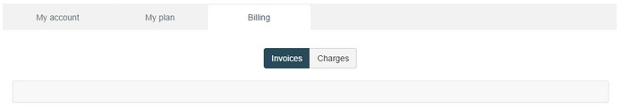

#Sign up process

The signup process of APISpark is straightforward.
Click on the sign in button and select your favorite social provider.
An account is automatically from the information transferred by the social network provider you selected. To view your APISpark account details, jump to the Account page (more details below).

1. Click on the Sign in button on top right of [https://apispark.com/](APISpark) welcome page.

	

2. Select a social network (github socail coding, Google, Windows Live, Yahoo, Facebook, Linked in, StackExchange or WordPress) for which you already have an account (or create an account on one of these networks before you go further).

	

3. Enter your username and password (if you are not already logged in).

#Account page

The Account page gives you information about your APISpark account.

1. Sign in to APISpark (if you are not already).
2. Click on your username on top right of your screen and select **My account**. The **Account** page displays.

	

Your **Account** page displays information on three different tabs:

  

##My account

 * The **Information** section gives you information about your profile and the social network accounts you use to connect to APISpark;  
 * The **Tokens** section gives you information about the token linked to your account. A token is created as you create your APISpark account. This token is your APISpark account identifier. You will not need this token to sign in to APISpark as you will enter your social network username and password.  
 * The **Access Log** section displays the last access logs to your account.

##My plan

From this tab, you can choose the plan you want to subscribe to and pay by entering your credit cards details and address.

##Billing

