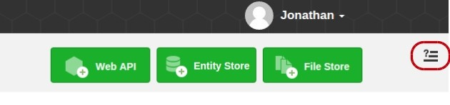

The interactive assistants are designed to accompany you while you discover the APISpark platform. You can start a tutorial at any time by clicking on the interactive assistants logo in the upper right corner of your screen.

Click on the tutorial title you want to start.

Check each step as you complete the tutorial. This way you will be able to track your progress.

Once you have completed a tutorial, click on the **Done** button. Why not take a look at some of the other tutorials we have to offer?

