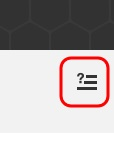
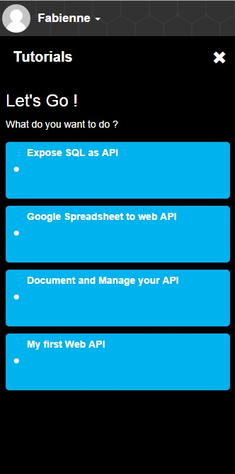
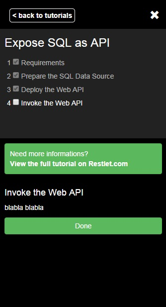
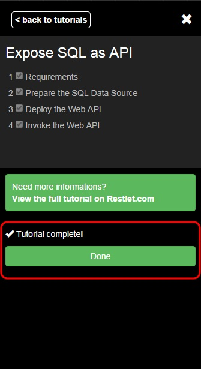
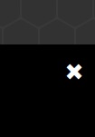

The APISpark interactive tutorials to are designed to accompany you while you discover the platform. You can start an interactive tutorial at any time by clicking on the interactive tutorial logo at the upper right of your screen. 

1. Click the interactive tutorial logo. The interactive tutorial panel displays on the right of your screen.

	

2. Click on the tutorial title you want to launch.
3. As you follow the different steps of the tutorial, select the checkbox to remember you have been through this step already.

	

	Once you have completed the whole tutorial, you can click on the **Done** button and have a look at the other tutorials at your disposal.

	

4. Click on the white cross on top right of your screen to close the interactive tutorials panel.

	
