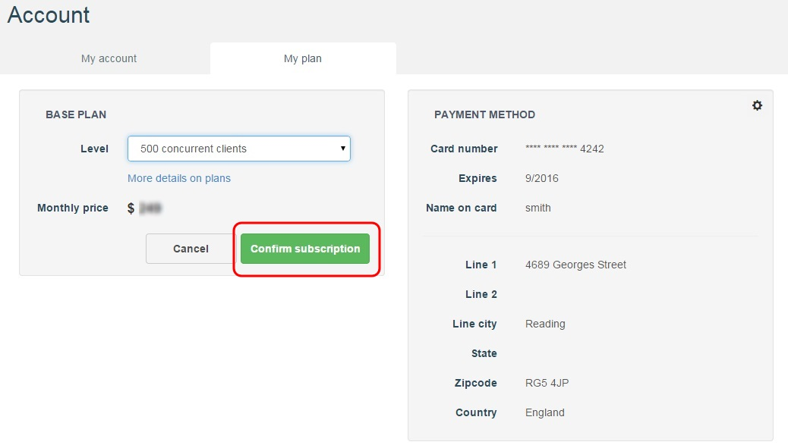

# APISpark Base plans

## Plans overview

As you subscribe to APISpark, you can choose between different base plan levels as defined in our <a href="http://restlet.com/products/apispark/pricing" target="_blan">Pricing page</a>. All levels include an unlimited number of APIs, an entity storage of 100MB, a file storage of 10GB, a bandwidth of 1TB and our best efforts for technical support. You can switch to a higher or lower plan at any time.

## Select a plan

When you Sign In, you are automatically assigned a **Free** plan. To upgrade your base plan level, you first need to enter your credit card details (see *Payment method* section below).

To switch base plan level, click on your name in the top right of your screen and select **My account**.

Open the **My plan** tab. In the **Level** drop-down menu, select your base plan level (10 to 2000 concurrent clients).

Click on the **Confirm subscription** button to activate the new plan.

# Payment methods

In order to updgrade your plan from the **Free** plan, you need to enter your credit card details.

To add a payment method to your account, click on your name on top right of your screen and select **My account**.

Click on **My plan** tab. In the **Payment method** section, click on the action button, shown below.

Enter your credit card details and click on the **OK** button.

Your credit card details are displayed in the **Payment method** section. You can now upgrade your base plan as described above.
