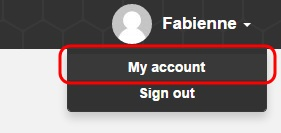
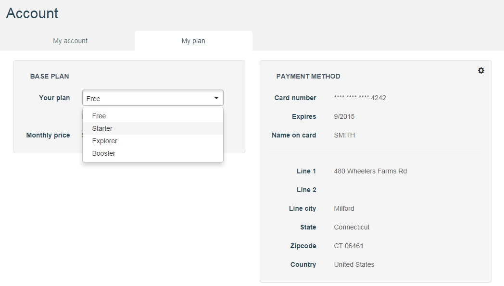
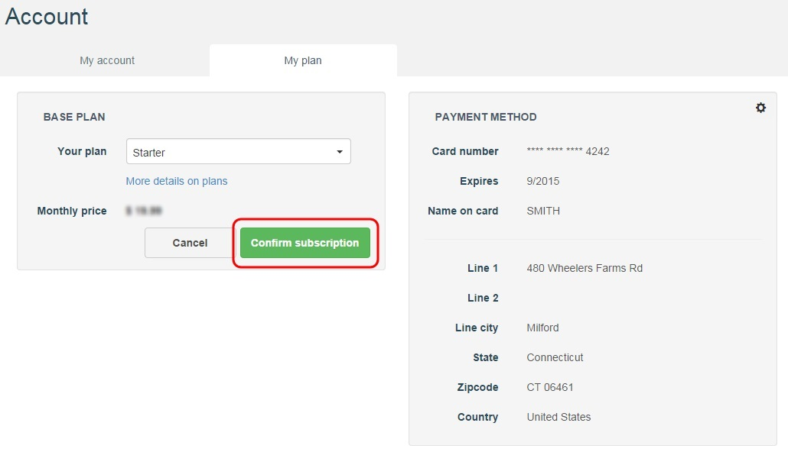
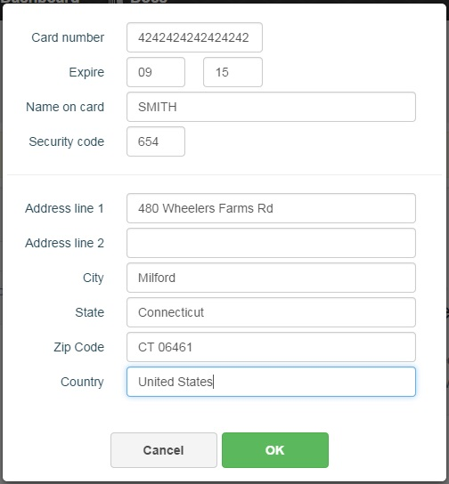

# APISpark Base plans

## Plans overview

As you subscribe to APISpark, you can choose between different base plans as defined in our [pricing section](https://apispark.com/pricing "pricing section").

## Select a plan

When you Sign In, you are automatically assigned a **Free** plan. To upgrade your **Base plan**, you first need to enter your credit card details (see *Payment method* section below).

To switch base plan, click on your name in the top right of your screen and select **My account**.

Open the **My plan** tab. In the **Your plan** drop-down menu, select a new base plan (**Free**, **Starter**, **Explorer** or **Booster**).

Click on the **Confirm subscription** button to activate the new plan.

# Payment methods

In order to updgrade your plan from the **Free** plan, you need to enter your credit card details.

To add a payment method to your account, click on your name on top right of your screen and select **My account**.

Click on **My plan** tab. In the **Payment method** section, click on the action button, shown below.

Enter your credit card details and click on the **OK** button.

Your credit card details are displayed in the **Payment method** section. You can now upgrade your base plan as described above.
