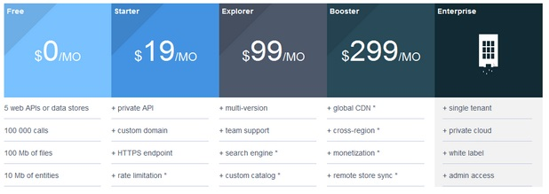

When you sign in, you are automatically assigned to a free plan.

**Account plans:**

- Each account has a unique plan that determines the features available to the account owner on APISpark, and to those other accounts using cells belonging to this account.
- The currently defined plans are: Free, Starter, Explorer, Booster, Enterprise.

  

Plans are hierarchical, meaning higher-level plans include the features of lower-level plans.
