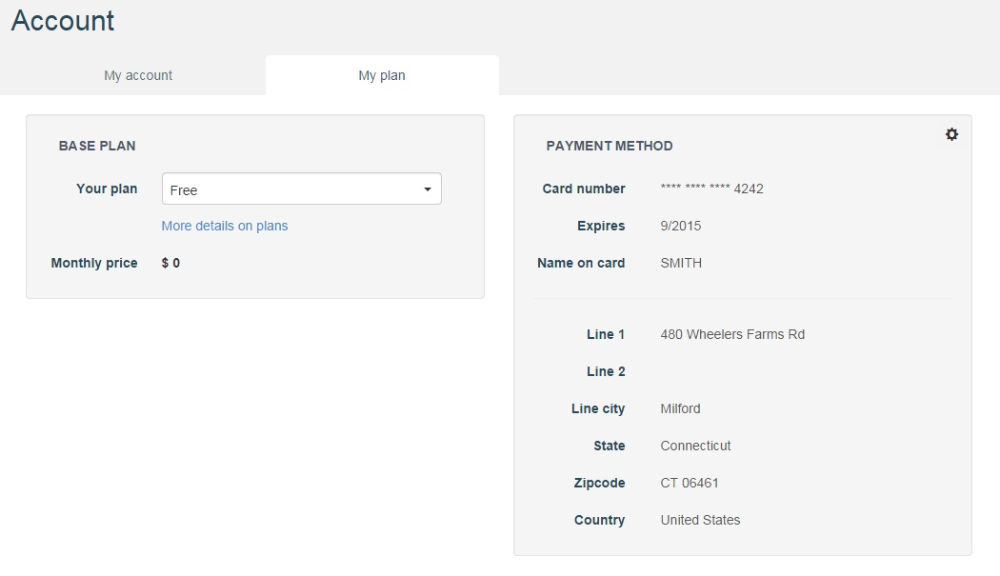

#Base plan

##Plans overview

 * Each account has a unique plan that determines the features available to the account owner on APISpark, and to those other accounts using cells belonging to this account.
 * The currently defined plans are: Free, Starter, Explorer, Booster, Enterprise.

Plans are hierarchical, meaning higher-level plans include the features of lower-level plans.

##Select a plan

When you sign in, you are automatically assigned to a free plan. To be able to select another base plan, you first need to enter your credit card details (see *Payment method* section below). To select a base plan:

1. Click on your name on top right of your screen and select **My account**.

	

2. Click on **My plan** tab.
3. In **Your plan** drop-down menu, select the appropriate base plan (**Free**, **Starter**, **Explorer** or **Booster**). 

	

4. Click on the **Confirm subscription** button.

	

	A message confirms you that you subscribed successfully to a base plan.

	

5. Click on the **OK** button.

#Payment method

To be able to select a base plan, you first need to enter your credit card details:

1. Click on your name on top right of your screen and select **My account**.

	

2. Click on **My plan** tab.
3. In the **Payment method** section, select the wheel. 

	

4. In the window that displays, enter your credit card details and click on the **OK** button.

	

	Your credit card details display in the **Payment method** section. You can now select your base plan as described above.

	

