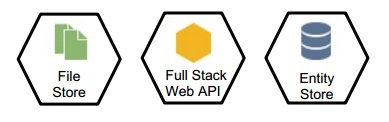
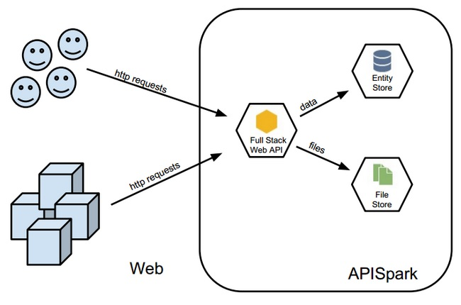

# Cell concept
APISpark relies on the concept of cells. A cell is a basic software package that can interact with other imported cells.

# Cell types
From APISpark, you can create two types of cells: Data Stores (Entity Stores or Files Stores) and web APIs.

<!-- TODO center -->

Web APIs import Data Stores and can be invoked by users.

<!-- TODO center -->

## Data Stores  
Two types of *Data Stores* can be created. *Entity Stores* for structured data (equivalent to a database) and *File Stores* for static files (text documents, images, videos or style sheets).

## Web APIs  
A *Full Stack web API* is an API (available web business once deployed via HTTP and exposing data).

# Cell characteristics

Each cell created is given a unique identifier on APISpark prefixed by its category (APIs or stores), and followed by its version number. Here is the identifier structure:  
`/<category>/<cell identifier>/versions/<version number>/`  
e.g. `https://apispark.com/apis/3373/versions/1/`  
This identifier will be requested by the APISpark HelpDesk team when assisting you.

> **Note:** You cannot directly invoke a DataStore, you need to first expose it through a web API which imports this store (see [Invoke a web API](technical-resources/apispark/guide/publish/publish/invocation "Invoke a web API")). A Web API can invoke several stores.
