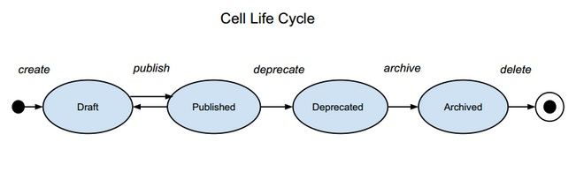

APISpark cells are always in one of the states of the cell lifecycle.

The states of the lifecycle and the possible transitions are shown in the diagram below.

#### Draft

This is the initial state.

Major modifications to the cell are allowed.

#### Published

The Published state is used to specify that a cell is in a stable state and is available to be used by end users or imported by other cells.

A Published cell cannot undergo structural modifications or be deleted as this could break clients or other cells using it.

If a Published data store is imported by a Published web API, then the data store cannot be reverted to Draft state while the API remains Published.

#### Deprecated

The Deprecated state is used to specify that a cell won't be supported in the near future, and should no longer be used.

A Deprecated cell cannot undergo structural modifications or be deleted as this could break clients or other cells using it.

If a Deprecated data store is imported by a Published web API, it cannot be reverted to Draft state while the API remains Published.

#### Archived

TODO: what is an archived cell ?

#### Deleted

Once a cell is deleted, it no longer exists in any dashboards and is no longer reachable.
