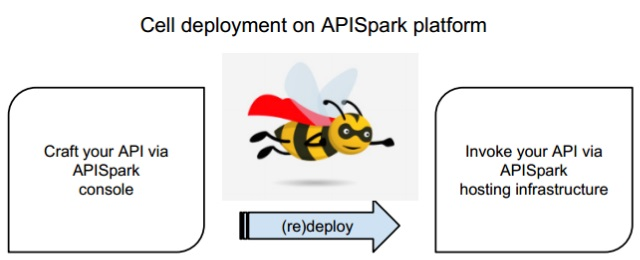
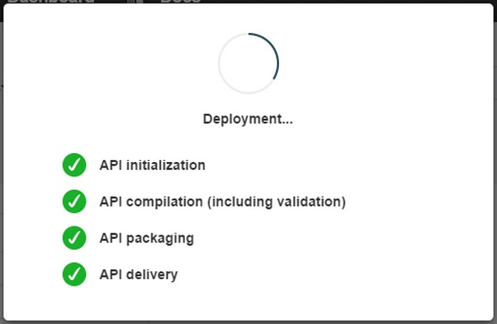

Your cells can be made available only once you have deployed them. Cells can be deployed from the draft, published and deprecated states. You can then re-deploy a cell at any moment.

The deployment process is composed of several steps:   
1. Your cell model is checked.  
2. Code is generated  and compiled for your cell.  
3. Your cell is actually deployed on the APISpark infrastructure.

Once you have clicked on the **Deploy** button, you can follow the different steps of the process in the information window that displays.

You can also check the deployment process of your cells in the **Messages** page: from your Dashboard, open the appropriate cell and click on the **Messages** tab. Events are listed in the **Traces** section.

