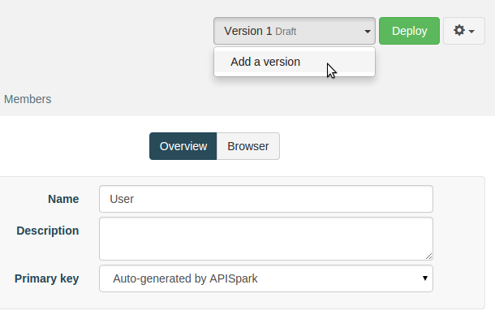
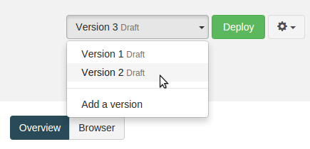

APISpark provides a version management system for your cells. When you create a new cell, version 1 is automatically created.

To add a new version of a cell, open the version drop-down menu next to the **Deploy** button and select "Add a version".

The new version of your cell will be a copy of the previous version. Multiple versions can be managed and executed in parallel.

To switch to a different version of a cell, select it from the version drop-down menu.

Note that with all Data Stores, different versions of the same store will point to the same dataset.

A versioned Entity Store (a store that has more than one version) can only be edited incrementally. This means you can add new entities and new properties to existing entities, but you cannot modify or delete existing properties or entities.

Versioning allows you to make a stable version of your cell available to your consumers while you keep working on a version that is in development, with no impact on your cell consumers.
