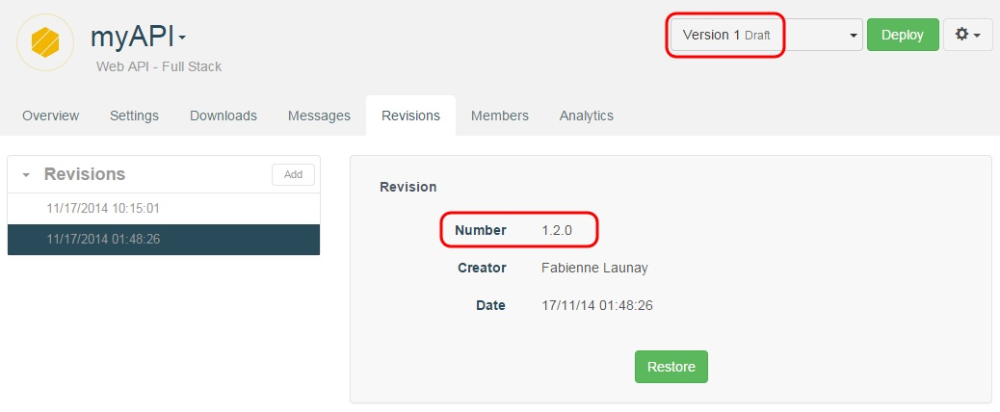
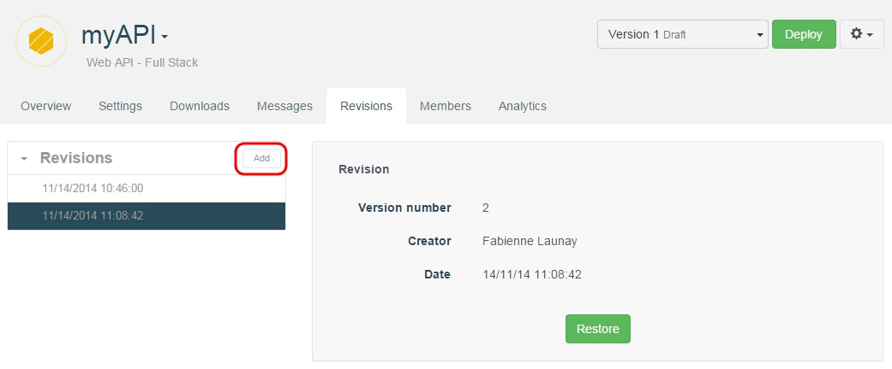
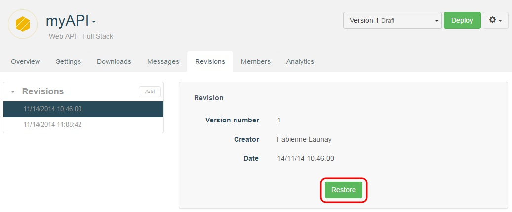

# What is a cell revision?

The **Revisions** tab contains a history of previous revisions of a cell. A revision is a copy of the state of a cell at the moment the revision was created. Every revision has a number, for example v1.2 is the second revision of a cell in its first version.

# Create a revision

A revision is created automatically every time you deploy a cell. You can also manually create new revisions from the **Revisions** tab by clicking on the **Add** button.

Each revision has an associated creation date, author, and revision number, that can be used to better identify a revision.

# Restore a revision

When you restore a revision, the current state of the cell being edited is replaced by the version of the cell stored along with the revision.

>**Warning**: Make sure you do not overwrite any important changes you have made to the current cell. One way to protect against this is to manually create a revision before restoring another.

To restore a revision:  

Open the appropriate cell.  
Navigate to the **Revisions** tab.  
Choose the revision you want to restore from the list of those available.  
Click the **Restore** button.

> **Note:** at this time, revisions are only available for full web API cells.
