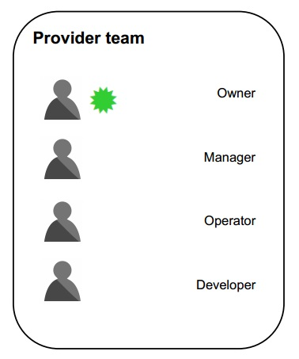
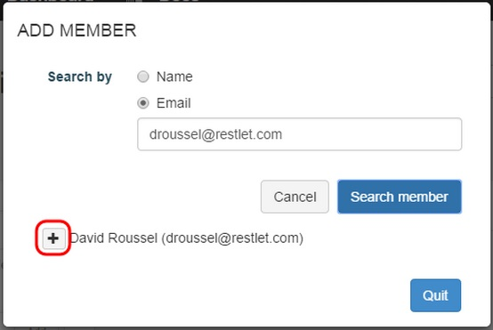

#Roles

We can distinguish two teams among APISpark stakeholders: the APISpark provider team and the APISpark user team. APISpark providers can also invoke cells as users if they are part of a user group.
APISpark lets you define how members of provider teams interact one with another. Provider team members can add members and grant roles to members. Giving a member either of the Manager, Developer, Operator or User roles will determine that member’s rights on the cell chosen in the web console. Roles and rights are defined at the cell level.

By default, APISpark proposes 6 roles. Each functional role gives specific permissions on cells in the APISpark console.

##APISpark provider team

 * **Owner:** an owner owns the cell and has full rights on it. An owner can switch between all roles. Each cell has a unique owner (and thus all cell versions have the same owner) that cannot be changed. An owner has specific permissions like copying the cell, deleting it, adding new version, etc.

 * **Manager:** a manager has near-full rights on the cell (but cannot delete it). A manager can switch between 2 roles (Manager or User).

 * **Operator:** an operator has runtime management rights as well as rights on lifecycle aspects of the cell and community management.

 * **Developer:** a developer has rights to design time and development aspects of the cell. A developer can switch between 2 roles (Developer or User).

##APISpark user team

 * **User:** a user can consult basic information about a Web API and be given runtime access rights. A user has no ability to switch to another role.

 * **Guest:** a guest can consult public information about a WebAPI.
If the cell is public, the person with this role can view the cell overview and ask to become a member (needs an APISpark account first). If the cell is private, he should not even know it exists. A guest has no ability to switch to another role.

# How to add a member to a cell

You can search for members, **TODO** ...
