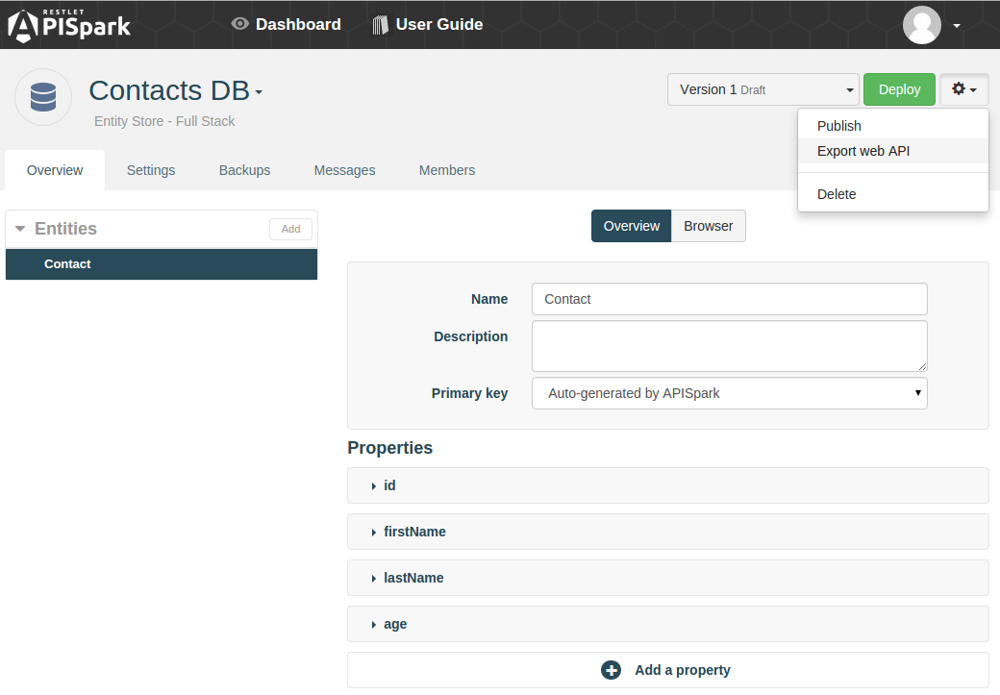
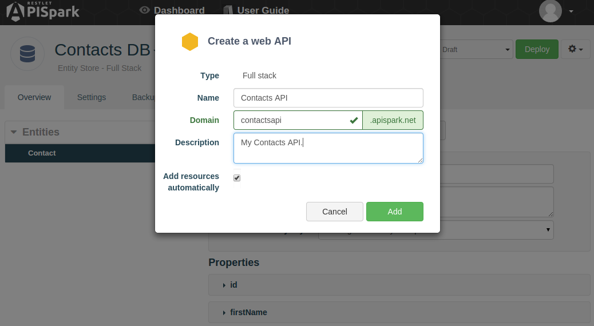
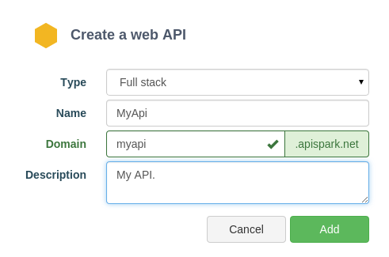
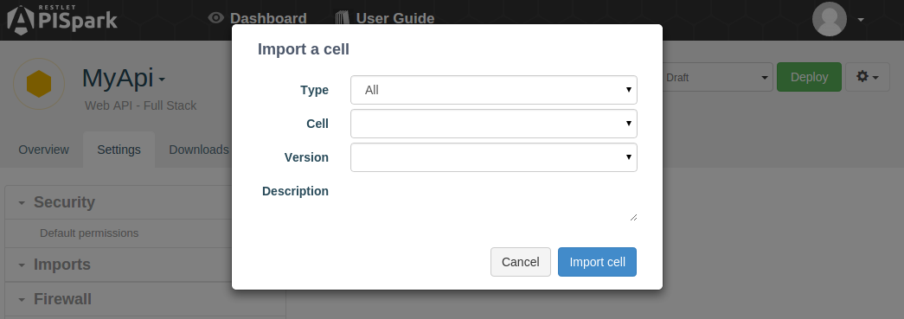
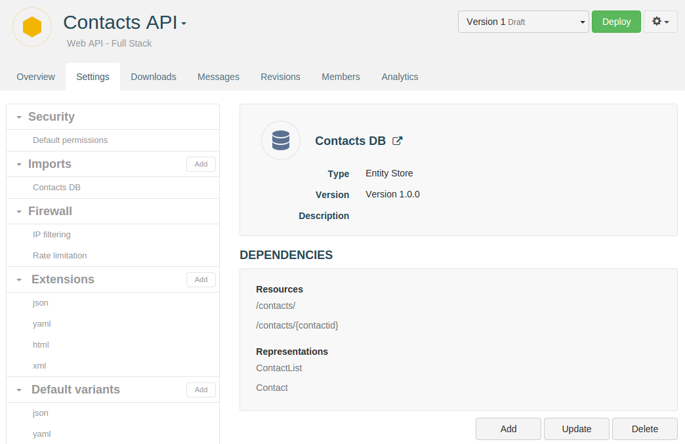

APISpark supports two major types of cells: Data Stores and Web APIs. Data stores serve to store structured data and static files, while Web APIs are RESTful interfaces that expose resources over the Web.

These two types of cells are built to work together, and APISpark provides tools that facilitate exposing Data Stores to the Web through web APIs.

In this section we look at different ways to automatically create a web API from existing Data Stores.

# Export a Web API from a Data Store

You can automatically export a web API from a Data Store. If you don't already have a Data Store, checkout the [Data Modeling](technical-resources/apispark/guide/store/entity-stores/model-data "Data Modeling") page to see how to build an Entity Store or the [File Store](technical-resources/apispark/guide/store/file-stores "File Store") page to see how to build a File Store.

The API export  process" can be launched from the Data Store **Overview**. Click on the action arrow and select **Export web API**.

In the **Create a Web API** dialog, give your API a **Name**, **Domain**, and **Description** (optional).

The window will notify you of the availability of the the domain name.

  > **Note:** When checked, **Add resources automatically** will create web API resources and representations that map towards the entities in your Entity Store. This is the recommended behaviour.

# Import a data store into an existing web API

As a complement to the Export API feature, APISpark lets you import one or more Data Stores into an existing web API.

This had the added benefit of allowing you to import multiple Data Stores of potentially different types into a single Web API.  

## Create a web API

If you already have an API in which to import a data store

If you haven't already done so, create a web API from the **Dashboard** by click on the **+ Web API** button.

  

Select **Full Stack** from the **Type** drop-down menu. Give your API a **Name**, **Domain**, and **Description** (optional).
The window will notify you of the availability of the the domain name.

  

## Import a Data Store

To import a Data Store into an API, navigate to the API's **Overview**. Click on the **Settings** tab. Click on the **Add** button next to **Imports** in the left panel.

  

Select the **Type** of cell you want to import, select the **Cell** itself and the **Version** you want to import.

### Generate resources and representations

Once you've imported a Data Store into a Web API, you can automatically generate resources and representations that map to the entities in the imported Data Store.

Select an import from the left panel of the API's **Settings** tab, and click on the **Add** button to generate new resources and representations.

If you update your Data Store, you can update the API's corresponding resources and representations by clicking on the **Update** button in the same window.
