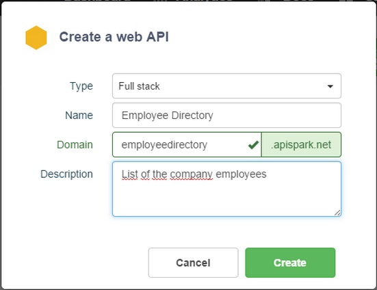

#Create a Web API

1. Open your APISpark **Dashboard** and click on the **+ Web API** button.

	

2. In the **Create a Web API** window:
 * Select **Full Stack** in the **Type** drop-down menu.
 * Enter the **Name** of your API.
 * Your domain name is automatically suggested in the **Domain** field according to the name you entered. If the domain address is not available, a red cross displays on the right of the domain address. You need to find another domain address. If the domain name is available, a green tick displays on the right of the domain address.
 * Enter a **Description** of your API.

	

3. Click on the Create button. A message informs you that your API has just been created.

#Import an Existing Data Store

##via the Export custom API feature

You can expose existing data by creating a Data Store and exporting a custom API.

1. From the **Dashboard**, open your Data Store.
2. Click on the Action drop-down menu and select **Export custom API**.

	

3. The **Create an API** window displays:

  	

  * Select **Full Stack** in the **Type** drop-down menu.
  * Enter the name of your API in the **Name** field.
  * Your domain name is automatically suggested in the **Domain** field according to the name you entered. If the domain address is not available, a red cross displays on the right of the domain address. You need to find another domain address. If the domain name is available, a green tick displays on the right of the domain address.
  * Enter a description of your API in the **Description** field.

  	> **Note:** You are creating a new Web API and importing your Entity store with its resources (deselect the Add resources automatically checkbox if you do not want to add the entity store resources).

4. Click on the **Create** button. A message informs you that your API has just been created.

##via the Import Ressources feature

You can also expose data by creating an API first and importing one or several data stores. If you need to import several data stores, we advise you to follow this process.

1. From your **Dashboard**, create a web API (or open an existing one)
2. Click on the **Settings** tab.
3. Click on the **+ Import** button.

	

4. In the **Overview** Section, select the **Type** of resource, the **Cell** and the **Version** you need to add.
5. Click on the **Add** button.
6. Click on the **Add resources** button to import the cell content.
7. Click on the **Overview** tab to check if the resources display.