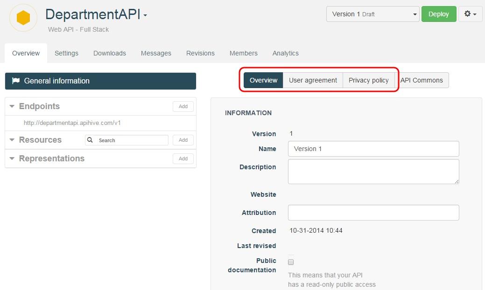
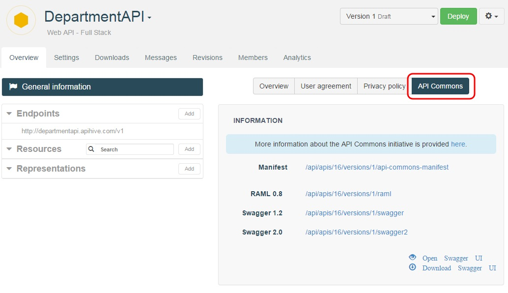

# General information

In APISpark, you can get general information by cliking the **General information** button in the **Overview** tab of the left panel. The central panel displays information in the **Overview**, **User agreement** and **Privacy policy** tabs. The API owner can enter information in those tabs and the consumer will have access to this information.

# Sharing an API design - API Commons

Once your web API has been designed, implemented and deployed, you can share it in the commons and participate in the effort for better API patterns. By sharing your design copyright free, you will enable other API providers to reuse it and set standards for APIs, facilitating the work of API users, plus you will take a stance as the provider of the API. The [API Commons](Sharing an API design - API Commons) initiative is just aimed at providing a service for this purpose.

To register your Web API on API Commons, you need to provide a JSON file. This file is auto-generated by APISpark and can be retrieved in the **Settings** page:

Click on the **General information** button in the **Overview** tab of the left panel. In the central panel, click on the **API Commons** tab. You can find different URLs for RAML or Swagger formats.

You can then go to [this page](http://apicommons.org/add-apis.html) to get instructions on how to use the api commons manifest file to index your API.
