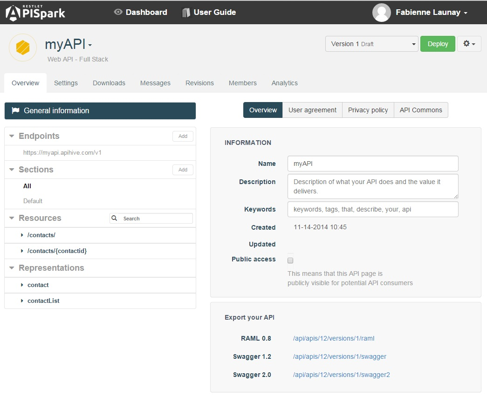
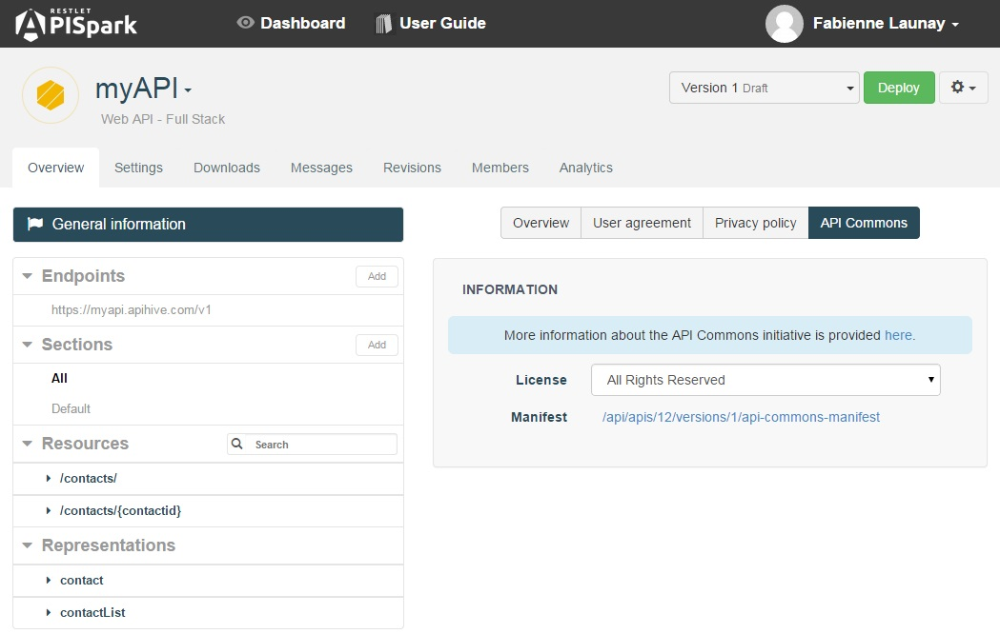

# General information section

From the **Overview** of a web API, the **General information** panel can be accessed by cliking the **General information** button in the left panel.

The **General information** panel provides an **Overview** tab concerning the general state of the web API, as well as tabs dedicated to the API's **User agreement**, **Privacy policy**, and shared use via **API Commons**. From the **Export your API** section (at the bottom of the panel), you will also find URLs that will take you to definition documents in different formats.

# Share an API design on API Commons

Once your web API has been designed, implemented and deployed, APISpark helps you share it in the <a href="http://apicommons.org/" target="_blan">API Commons</a> and participate in the effort to collaborate on and share great API designs.

By sharing API your design *copyright free* on API Commons, you will enable other API providers to reuse it and thus contribute to the converge of API designs. This makes life easier for API consumers, and lets you take a stance as the provider of the API.

To register your Web API on API Commons, you need to provide the commons with an API Commons manifest. APISpark lets you automatically generate this JSON file.

To obtain your automatically generated API manifest, navigate to the **API Commons** tab from the **General information** panel.

From this panel you will find the API Commons manifest.

Please then navigate to the API Common's <a href="
http://apicommons.org/add-apis.html" target="_blan">Add an API</a> page for instructions on how to upload your API Commons manifest file.
