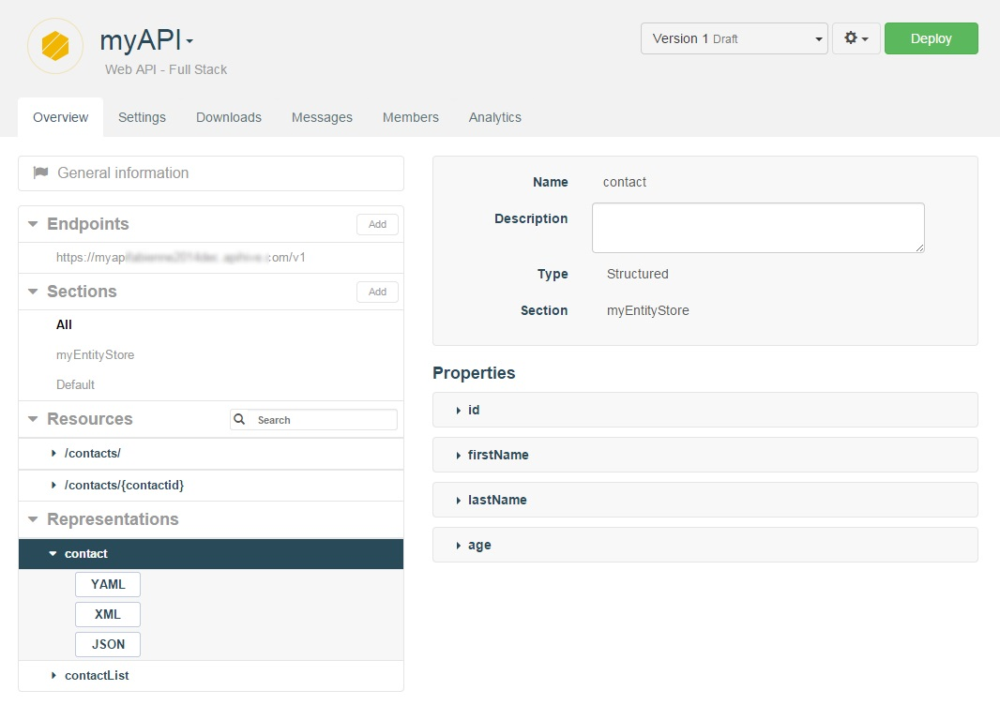
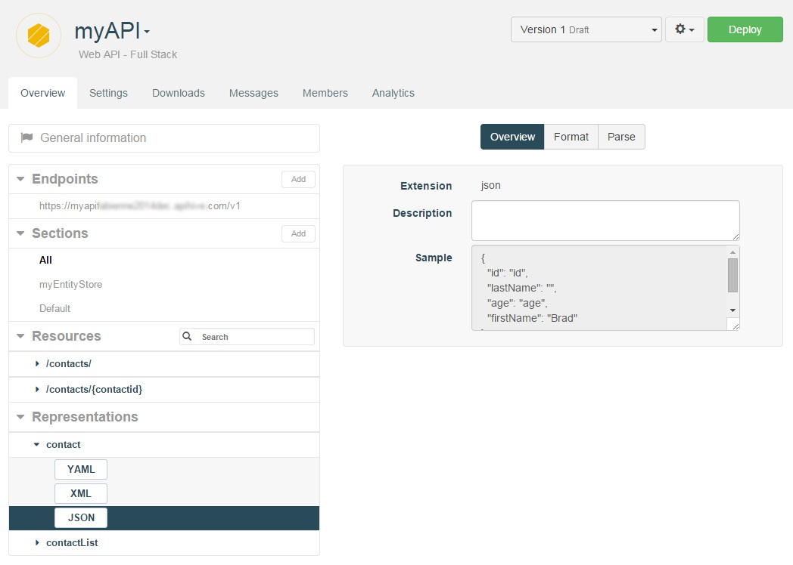

A web API has a set of **Representations** that are used as input and output types for the API's resource methods.

A **Representation** has a **Name** and a **Description** (optional), and is composed of **Properties** which hold values.

To edit a web API's **Representations**, navigate to the Web API's **Overview**. The API's representations are listed in the **Representations** section in the left panel.

Once you have select a **Representation**, you can view its properties.

Representation properties have a **Name**, **Datatype**, and cardinality (**Min occurs** and **Max occurs**).

# Variants

A **Representation** has one or more **Variants** which determine how the representation is formatted, serialized, and deserialized.

By default, APISpark supports 3 different types of representation variants: XML, JSON or YAML.  

To view a representation's **Variants**, select the representation from the **Representations** section in the left panel.

>**Note:** When you want to POST a new entry via [Postman](technical-resources/apispark/guide/create/test "Postman") tool for example, you can use the **Sample** text area content to make sure you are using the appropriate syntax.
