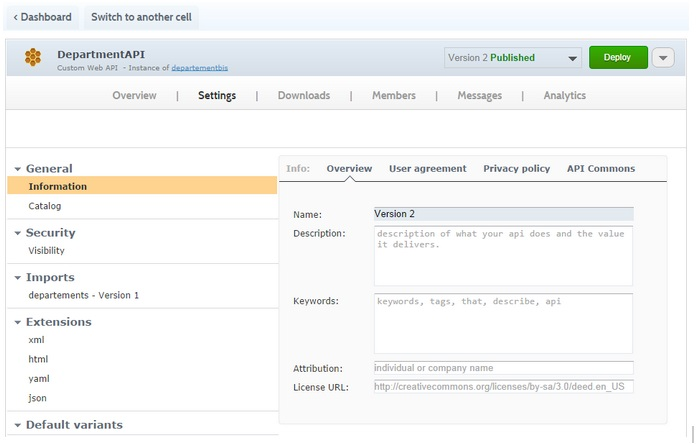
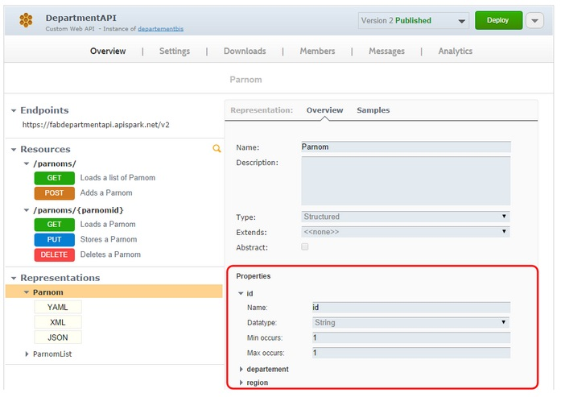

#Author & license
In APISpark, you can find information about author and license.

In the **Settings tab**, select **Information** in the **General** section. Click on the **Overview** tab.

#Sharing an API design - API Commons
Once your web API has been designed, implemented and deployed, you can share it in the commons and participate in the effort for better API patterns. By sharing your design copyright free, you will enable other API providers to reuse it and set standards for APIs, facilitating the work of API users, plus you will take a stance as the provider of the API. The [API Commons](Sharing an API design - API Commons) initiative is just aimed at providing a service for this purpose.

To register your Web API on API Commons, you need to provide a JSON file. This file is auto-generated by APISpark and can be retrieved in the **Settings** page:

In the **Settings** tab, select **Information** in the **General** section. Click on the **API Commons** tab. You can file the file in the **Manifest URL** field.

You can then go to [this page](http://apicommons.org/add-apis.html) to get instructions on how to use the api commons manifest file to index your API.

#Endpoints
An API endpoint is the address or URI (Uniform Resource Identifier) where the service can be accessed by a client application. The same web service can have multiple endpoints, for example in order to make it available using different protocols.
Here is a URI example: `https://departmentapi.apispark.net/v2`
On APISpark console, you can find the different endpoints of your API in the **Overview** tab. Your endpoints display in the **Endpoints** section.

To add new endpoints, click on the **Add** button of the **Endpoints** section.

#Resources
Each resource has its own address or URI (Uniform Resource Identifier). Resources should be named by nouns as opposed to verbs or actions. In other words, a URI should refer to a resource that is a thing instead of referring to an action: nouns have properties as verbs do not.
On APISpark console, you can find the resources of your API endpoint in the **Overview** tab. Click on the appropriate endpoint. The resources linked display in the **Resources** section.
Here is a resource example: `https://employeedirectory.apispark.net/v2/employees`
For each resource, the possible request methods (POST, GET, PUT and DELETE) are displayed underneath.
A **Search** field allows you to find back your resources faster.
To change the resource path, click on the appropriate resource in the **Resources** section and enter a new path in the **Relative path** field.

#Representations
Essentially, an API is a collection of URIs, HTTP calls to those URIs and some representations of resources. APISpark offers 3 different representation types: XML, JSON or YAML.
On APISpark console, you can find the representations of your API endpoint resource in the **Overview** tab. Click on the appropriate endpoint and the appropriate resource in the **Representations** section. The representations available for the resource selected display in the **Representations** section.

To modify representation properties, click on the appropriate representation in the **Representations** section, select the appropriate property on the right hand side of the screen and change the elements you need to modify.

