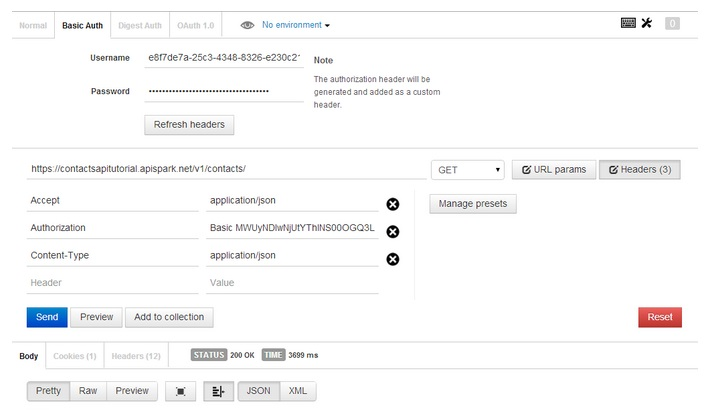
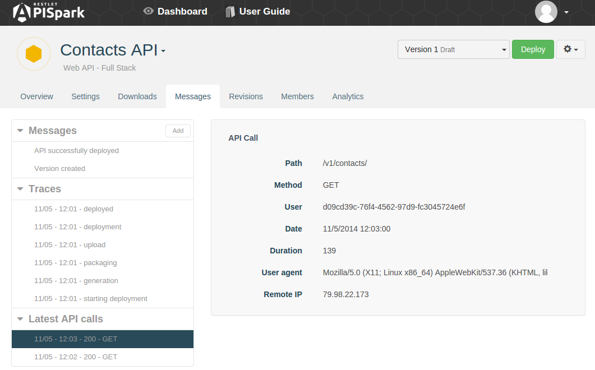

# Requirements

In order to test and debug a web API, certain number of requirements must be met.

1. The API must be deployed. Please visit the [Cell deployment](apispark/guide/explore/cell-deployment "Cell deployment") page if you don't know how to deploy an API.
2. You need access credentials if the API if not open to *anyone*. Please visit the [Invocation](apispark/guide/publish/publish/invocation "Invocation") page if you don't know how to obtain and view your API access credentials.

# Invoke a Web API with POSTMAN

Using a Web API does not impose any particular programming language. It can even be done from a web browser. However, to test your API we recommend the use of tools such as the Chrome extension POSTMAN and DHC that provide a graphical user interface to perform HTTP calls.

1. When using POSTMAN, click on the **Basic Auth** tab, fill in the **Username** and **Password** fields with the information copied from your APISpark **Endpoints**.
2. Fill in the **Endpoint URI** and add the name of a resource e.g. `/contacts/ `at the end of it. (E.g. `https://employeedirectory.apispark.net/v1/contacts`).
3. To retrieve the list of contacts in JSON, click on the **Headers** button on the far right and input the **Accept** command in the **Header** field and write **application/json** in the **Value** field opposite.
4. Click on the **Send** button.

  

# Check your messages

The web API's **Messages** tab displays messages pertaining to different aspects of you API's life.

This is a great place to go to when testing your API.

## Messages

The **Messages** section in the left panel contains general messages pertaining to APISpark internal process such as version creation, and deployment.

## Traces

The **Traces** section contains detailed log messages pertaining to processes such as deployment.

If one such process were to result in a error, the **Traces** section can provide usefull information as to why the process failed.

## Latest API calls

The **Latest API calls** section lists the latest HTTP calls made to a deployed web API.
