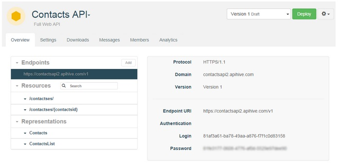

As a member of the API core team (as an API team provider), you are given API credentials (login / access token). These credentials are accessible from APISpark. You can invoke an API from any web browser or you can use tools such as Chrome extension POSTMAN to obtain a more visual representation of your API (see Invoke a WebAPI with POSTMAN).

#Find credentials to invoke an API
1. From your **Dashboard**, open the appropriate API.
2. In the **Endpoints** section of the **Overview** tab, select the appropriate endpoint. The credentials display in the right part of the screen.
	> **Note:** To invoke an API, you will need to copy the **Endpoint URI**, **Login** and **Password**.

	

#Invoke a Web API with POSTMAN
Using a Web API does not impose any particular programming language. It can even be done from a web browser. However, to test your API we recommend the use of tools such as the Chrome extension POSTMAN and DHC that provide a graphical user interface to perform HTTP calls.

1. When using POSTMAN, click on the **Basic Auth** tab, fill in the **Username** and **Password** fields with the information copied from your APISpark **Endpoints**. 
2. Fill in the **Endpoint URI** and add the name of a resource e.g. `/contacts/ `at the end of it. (E.g. `https://employeedirectory.apispark.net/v1/contacts`).
3. To retrieve the list of contacts in JSON, click on the **Headers** button on the far right and input the **Accept** command in the **Header** field and write **application/json** in the **Value** field opposite.
4. Click on the **Send** button.

This figure shows the API call with POSTMAN. 