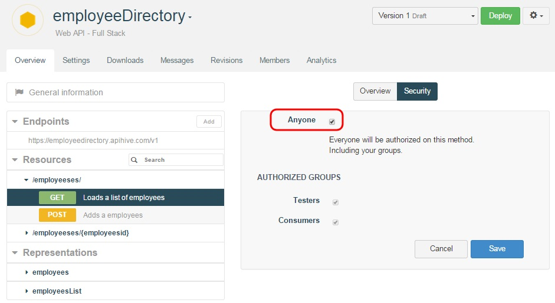

#Private APIs

##Cell version access rights

APISpark allows you to define default access rights at the cell version level.

1. From the cell **Overview** page, click on the **Settings** page.
2. In the **Security** section, select **Default permissions**.
3. A table displays the 4 methods possible and who has right on each method.

>**Note:** Select the **Anyone** checkbox to give rights to anyone including anonymous users who consume public APIs.

##Resource method access rights

You can also customize access rights on each Resource method individually.

1. From the cell **Overview** page, click on the appropriate method in the **Resources** section.
2. Select the appropriate checkbox in order to set your method access rights (**Anyone**, **Testers** and/or **Consumers**).

>**Note:** Select the **Anyone** checkbox to give rights to anyone including anonymous users who consume public APIs.

#Public APIs

You may have one or several web API methods that can be invoked without user authentication.

