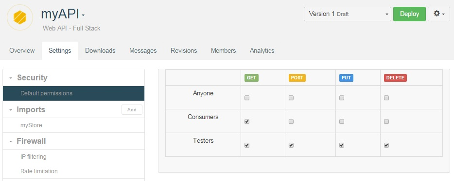
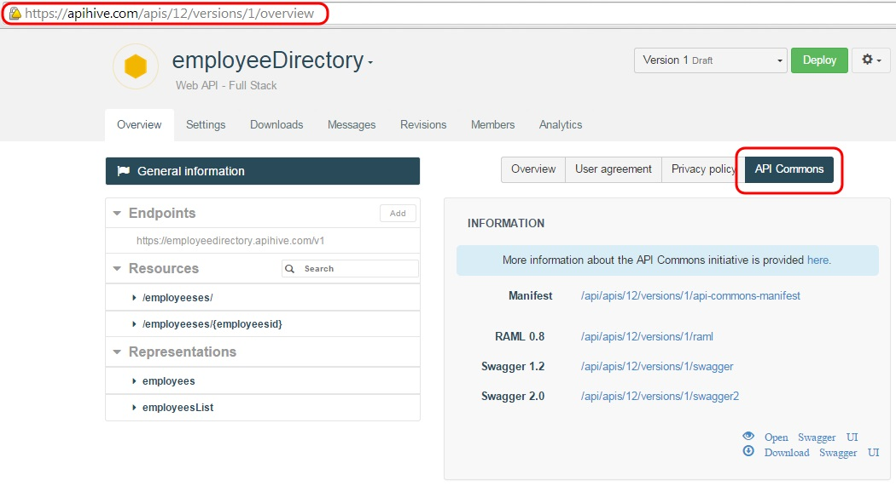

# Configure runtime access for groups

Runtime access to an API is configured by allowing specific resource methods for specific groups.

## Configure default permissions

Default permissions allow you to define group/method permissions once and for all. Every new resource created will then inherit these default permissions.

To configure default permissions for an API, go to the **Settings** tab, and select **Default Permissions** from the left panel.

>**Note:** Select the **Anyone** checkbox to give rights to anyone including anonymous users who consume public APIs.

## Configure method level access

Select a method belonging to one of the resources in the left panel of a web API's **Overview**. Open the method's **Security** tab in the central panel.

The **Security** panel lets you decide which methods are open to which member groups for this specific resource.

>**Note:** Select the **Anyone** checkbox to give rights to anyone including anonymous users who consume public APIs.

## Opening a method to Anyone

API methods can be opened to *anyone*. A method opened to *anyone* can be invoked without authentication.

To configure a method's runtime access to *anyone*, in either method-level or default permissions, check *anyone* in the appropriate menu.

> **Note:** You will need to redeploy your API in order to take into account changes in groups and permissions.

# Make your API documentation public

If you want users to access your API documentation without authentication, you can make it public. Once made public, you can communicate the link of your API **Overview** page or the different links available in the **API Commons** tab (RAML, Swagger formats, etc.).

To make your API documentation public:

1. Open your API **Overview** page.
2. In the central panel, click on the **Overview** tab .

  

3. Select the **Public documentation** checkbox.
