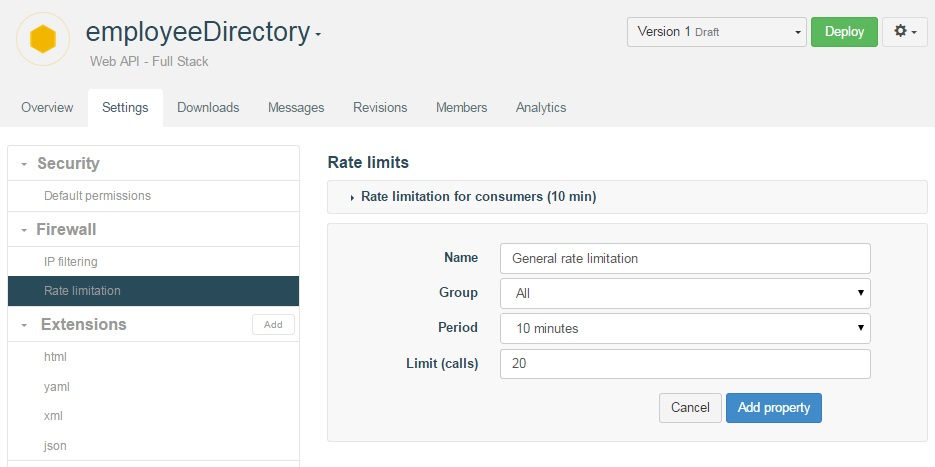

APISpark allows you to determine different firewall settings from the **Settings** tab.

# IP filtering

You can filter the use of your API by filtering the APIs that will access it. You can either choose to define the IP that will be allowed to access it or those which will not be allowed to access it.

1. Open the your web API **Overview** page and click on the **Setting** tab.
2. In the **Firewall** section, select **IP filtering**.

  

3. In the **IP list** text area, enter the different IP addresses seperated by a coma.
4. Select the appropriate **Type** radio button (Blacklist or Whitelist).

# Rate limitation

You can limit your API consumption in time and number of calls for the groups of consumers and/or testers chosen. You can create a limitation for each group created.

1. Open the your web API **Overview** page and click on the **Setting** tab.
2. In the **Firewall** section, select **Rate limitation**.

  

3. Enter a **Name** for the limitation you want to set e.g. "rate limitation for consumers (10 minutes)", select the appropriate **Group**, a **Period** and a maximum number of calls (**Limit**).

>**Note:** When you select **All** as a group, you create a rate limitation for every testers and consumers including anonymous users who consume public APIs. Users who signed in are limited by their token when anonymous consumers are limited by their public IP.
>As your users can belong to several groups, the limitation applied will always be the largest one.
