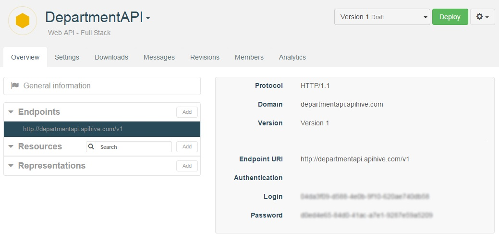

# Access an API

APISpark web APIs are either *public* or *private*. This affects the way you access the Web API's documentation, including access tokens, but does not have an affect on invoking the API at runtime.

## Access a private API

In order to browse a private web API's documentation and get your access tokens, you need to be a member of the API. To see how to create web API members, please visit the [User Groups](technical-resources/apispark/guide/publish/secure/user-groups "User groups") page.

Navigate to the API's overview. If you are a member of the API, it will appear in your **Dashboard**.

Select an Endpoint in the left panel. The central panel displays your access tokens.



## Access a public API

Public web APIs can be browsed by anyone, without authentication. A public API is not necessarily open to anyone at runtime. This is configured from the [User Groups](technical-resources/apispark/guide/publish/secure/user-groups "User groups") page.

## Basic authentication access tokens

To view your security tokens to access an API, select an Endpoint from the list in the left panel of the **Overview** tab. The central panel displays your access tokens.

# Invoke an API

In order to invoke an API, you must belong to one of the API's consumer groups with sufficient runtime permissions.

However, some APIs are open to anyone without authentication.

To see how to configure a web API's runtime permissions, including opening an API to *anyone*, please visit the [User Groups](technical-resources/apispark/guide/publish/secure/user-groups "User groups") page.

## Making HTTP calls

APISpark web APIs respect the principles of REST. Therefore, CRUD operations can be performed on resources exposed by the APIs.

### Invoking a collection resource

A collection resource is typically identified by a URL that ends in the name of a type of data, in plural.

`https://contactsapi.apispark.net/v1/contacts/ `

Sending a GET request to this URL will list all Contacts stored by the server.

Sending POST request to this URL with result in the creation of a new Contact, and the payload of the request will be used to initialise the Contact's properties.

### Invoking an element resource

An element resource is typically identified by a URL that ends in the name of a type of data followed by the unique identifier of the element.

`https://contactsapi.apispark.net/v1/contacts/1234 `

Sending a GET request to this URL will list the details of the Contact whose identifier is 1234.

Sending a PUT request to this URL will update the Contact whose identifier is 1234, the update will be based on the payload of the request.

Sending a DELETE request to this URL will delete the Contact whose identifier is 1234.  

## Query parameters

Entity stores exposed through a web API support a rich query language for collection resources. The query language is based on a set of special parameters that are passed as query parameters in HTTP GET requests on collection resources.

### Filter

The results of a GET request on a collection resource can be filtered based on the values of properties of the representations returned.

By default, every property of a representation can be used as a filter criteria.

Currently, the only supported comparison operator is equality.

All filter criteria in a GET request are combined with AND logic.

**Syntax**

`GET https://<apiendpoint>/<collection_name>/?<property1>=<value1>&<property2>=<value2>&...`

**Example**

`GET https://contactsapi.apispark.net/v1/contacts/?age=27&firstname=roy`

### Sort

The `$sort` query parameter is used to sort results in either ascending or descending order based on the value of a property. Multiple sort criteria can be used simultaneously.

Ascending order is used by default if none is specified.

**Syntax**

`GET https://<endpoint>/<collection-name>/?$sort=<property1> <sort-order>,<property2> <sort-order>,...`

**Example**

`GET https://myapi.apsipark.net/v1/messages/?$sort=creationDate ASC,size DESC`

In this request, we sort a collection of messages by their creation date in ascending order, and then by size in descending order.


### Paginate

In case you have many entries stored in a collection, you may not want to read them all at once when invoking the API. The `$page` and `$size` query parameters let you specify the size of a page, and which page number to load.

**Example**

`GET https://myapi.apsipark.net/v1/messages/?$page=4&$size=100`

### Load Strategy

The `$strategy` query parameter is used to define whether or not to load data references, and if so at what depth.

`$strategy` can take values *load* or *reference*. The default load strategy is *reference*.

If the load strategy is specified, the `$depth` parameter indicates at which depth related data should be loaded.

**Examples**

**Data model**: An Organization has Employees which each have an Address.

*Reference strategy*

`GET https://myapi.apsipark.net/v1/organizations/?$strategy=reference`

In this request, the `$strategy` is set to *reference*, therefore the list of Organizations is loaded along with all the values of primitive type properties (e.g. name). Employees are only loaded by reference.  

```json
{
  "list": [
    {
      "id": "1234",
      “name”: “Restlet”,
      "employees": [
        {
          "id": "2345",
          "name": null,
          “address”:null
        },
        {
          "id": "2345",
          "name": null,
          “address”:null
        }
      ]
    }
  ]
}
```

*Load strategy*

`GET https://myapi.apsipark.net/v1/organizations/?$strategy=load`

In this request, in which the `$depth` parameter is set to its default value 1, Organizations are loaded along with the first level of related data, therefore the values of primitive type fields of Employees are also loaded.

```json
{
  "list": [
    {
      "id": "1234",
      “name”: “Restlet”,
      "employees": [
        {
          "id": "2345",
          "name": “Roy”,
          “address”:{
            "id": "4567",
            "value": null
          }
        },
        {
          "id": "3456",
          "name": “Ada”,
          “address”:{
            "id": "5678",
            "value": null
          }
        }
      ]
    }
  ]
}
```

*Load strategy, depth set to 2*

`GET https://myapi.apsipark.net/v1/organizations/?$strategy=load&$depth=2`

In this request, in which the `$depth` parameter is set to 2, Organizations are loaded along with the first level of related data (Employees) along with the third level of related data (Employee Addresses).

```json
{
  "list": [
    {
      "id": "1234",
      “name”: “Restlet”,
      "employees": [
        {
          "id": "2345",
          "name": “Roy”,
          “address”:{
            "id": "4567",
            "value": “123 Happy Street, Happy Land”
          }
        },
        {
          "id": "3456",
          "name": “Ada”,
          “address”:{
            "id": "5678",
            "value": “234 Funky Road, Funky Town”
          }
        }
      ]
    }
  ]
}
```

# HTTP response codes

Coming soon.
