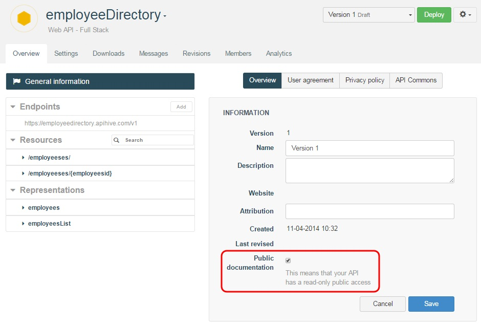
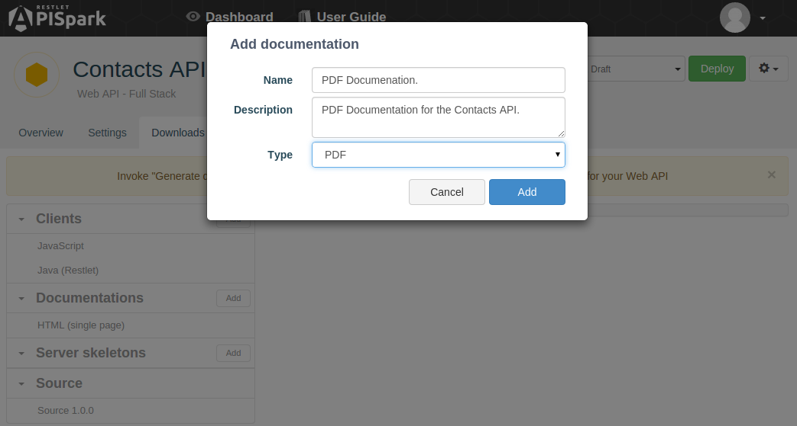
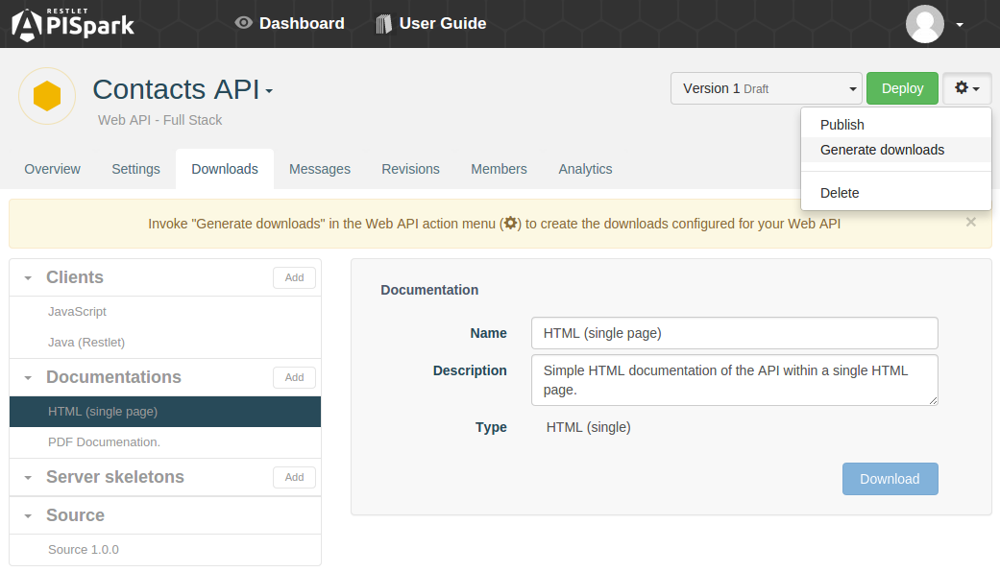
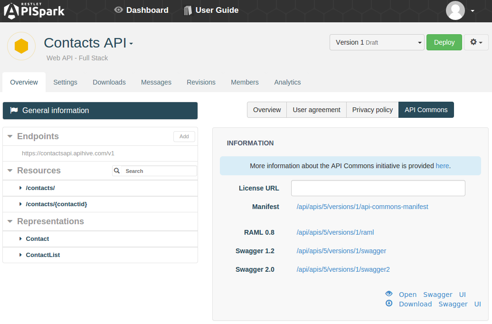
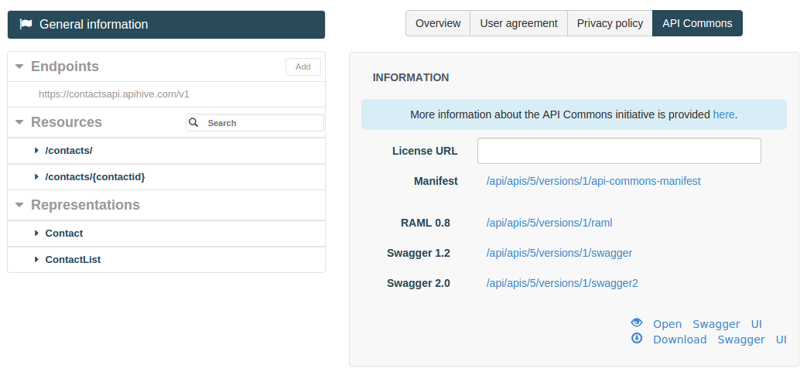

An important part of running a web API is documenting it so that consumers of your API can invoke it with ease.

APISpark is very flexible in this regard and provides three different ways to document you APIs that are hosted on APISpark.

APISpark will also provide automatic documentation for existing APIs that are not hosted by APISpark. In this case, please visit the section called [Document existing web APIs through APISpark Descriptors](apispark/guide/document/overview "Document existing web APIs through APISpark Descriptors").

# Make your API documentation public

If you want users to access your API documentation without authentication, you can make it public. Once made public, you can share the link to your API's **Overview** page or other public pages such as the **API Commons** tab.

To make your API documentation public:

1. Open your API **Overview** page.
2. In the central panel, click on the **Overview** tab.
3. Select the **Public documentation** checkbox.

	


# Download your API's documentation

APISpark provides a way for you to download documentation for web APIs. This way you can, for example, host the documentation on your own website. Documentation is provided for download in a number of different formats.

## Add new documentation for download

In order to be able to download documentation for your API, you need to first define the documentation you want to make available.

To do this, navigate to an API's **Overview**, open the **Downloads** tab, and click on the **Add** button next to the **Documentation** section in the left panel.

You will be prompted to select a **Name** and **Type** (format) for your new downloadable documentation.



Once the desired types of documentation have been added to the **Documentation** section, you will need to generate the downloads for your API.

To generate the downloads for an API, open the API's **Overview**, click on the pop-down action button and select **Generate downloads**.



Your documentation can now be downloaded from the **Documentation** section by selecting a type of documentation from the list and clicking on the **Download** button.

# Your API's Swagger definition

**Swagger** is an API description language that comes with a number of tools including Swagger UI and Swagger Code Generator. Swagger UI provides a nice HTML presentation of your API’s contract and allows you to test your API by calling it. The Swagger Code Generator generates client kits for your API in eight languages.

APISpark *automatically* produces a Swagger definition for APIs it hosts. You can share the Swagger definition's URL with your users, download the Swagger definition itselft, and you can even view the definition directly on APISpark via the Swagger User Interface.


## Obtain your API's Swagger definition

To access your API's automatically generated Swagger definition, open the API's **Overview** and open the **General information** tab from the left panel.

Open the **API Commons** panel.



Click on one of the **Swagger** URLs to open the corresponding Swagger definition. Note that multiple versions of Swagger are supported.

The **Swagger 1.2** definition for the Contacts API looks like this:

```json
{  
   "apis":[  
      {  
         "path":"/contacts"
      }
   ],
   "apiVersion":"1.1.0",
   "info":{  
      "contact":"jmichaux@restlet.com",
      "description":"My Contacts API.",
      "title":"Contacts API"
   },
   "swaggerVersion":"1.2"
}
```

## Check out your API's Swagger UI

The **Swagger UI** is a useful tool for visualizing an API's documentation and performing simple tests.

APISpark lets you directly view your API's Swagger UI from its **General information** tab in the **API Commons** panel.

To view you **API's Swagger UI**, click on **Open Swagger UI**.



Your API's **Swagger UI** will open in a new web page.

## Download your API's Swagger UI

From an API's **API Commons** panel, you can download a version of its Swagger UI.

To download your Swagger UI, click on the **Download Swagger UI**.

The screenshot below is an example of what the Swagger UI looks like.  


