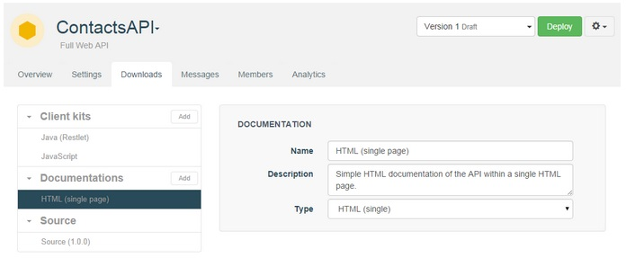
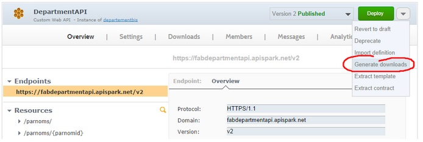
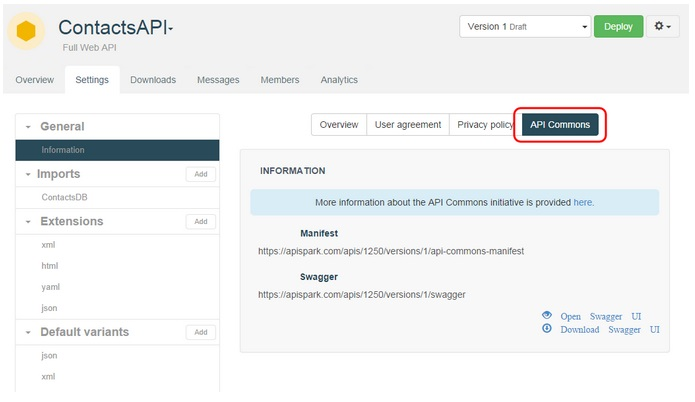
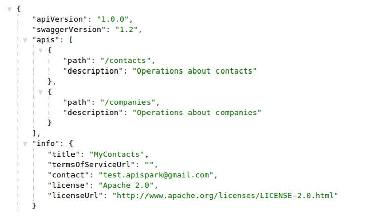
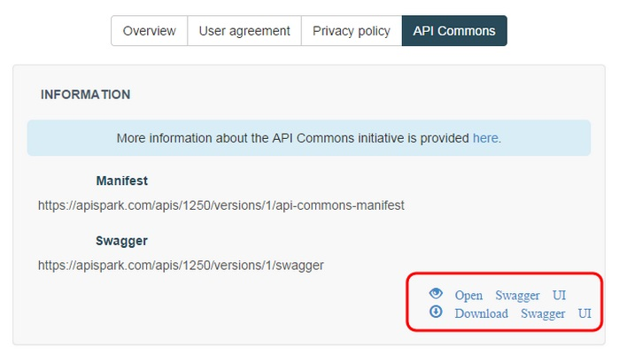
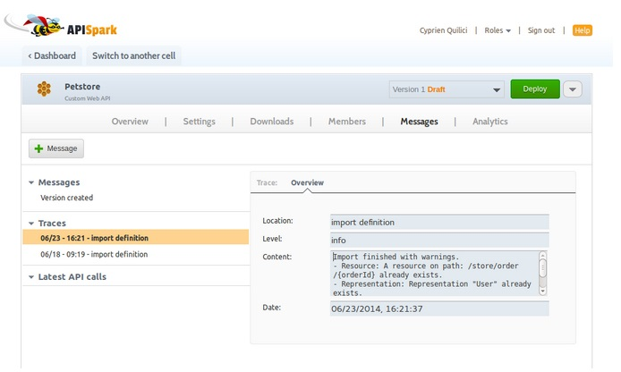

Three levels of documentations are available through APISpark:

#via the Web API overview
All APISpark users and visitors can have access to the overview page of your API as a documentation. You need to turn your API into a public one.

1. Open an API.
2. Select All versions in the version drop-down menu.
3. In the Settings tab, click on Information in the General section.
4. Select the Public checkbox.

#produce an HTML documentation
You can download the HTML documentation of your API as an HTML or PDF file and host it by yourself.

1. Open an API.
2. Click the actions arrow and select **Generate downloads**.

	

3. Click on the Downloads tab.
4. Click on HTML (single page) in the Documentations section.
5. Click on the Download button to generate the HTML documentation.

#check out the Swagger definition
APISpark produces a Swagger definition of APIs automatically. You can communicate the URL of this swagger documentation, but also visualize it directly on APISpark via the Swagger User Interface.

##Introduction
Swagger is an API description language that comes with a number of tools including Swagger UI and Swagger Code Generator. Swagger UI provides a nice HTML presentation of your API’s contract and allows you to test your API by calling it. Swagger Code Generator generates client kits for your API in eight languages.

APISpark dynamically generates the Swagger description of web APIs and provides the Swagger UI and Code Generator capabilities as a service. You can also import an existing Swagger description into APISpark to update a web API contract.
##Get the Swagger definition of your API
1. Select the web API you want to get the Swagger definition of.
2. Open the **Settings** tab and click **Information** in the **General** section, then on the **API Commons** tab on the right part of your screen.
	

Underneath **Swagger**, you will find the address in which the Swagger definition of your API is hosted.

##Check out its Swagger UI

Still in the **API Commons** tab, you can download a local version of Swagger UI with the **Download Swagger UI** link. You can also open it on APISpark with the **Open Swagger UI** link. 

##Import existing Swagger definitions
You can import a web API’s contract to APISpark using its Swagger definition by providing the URL on which it is available to APISpark.

1. From an existing API page, click on the actions arrow on top right of your screen and select **Import definition**. 
	
2. In the **Import a Web API definition** window, fill in the different fields to import the representations and resources of a Swagger definition into your API.
	
3. Click on the **Import** button. The representations and resources of the Swagger definition you provided the link to are imported in your **Overview** tab.
	

 >**Note:** If you import several definitions you may have conflicts, multiple resources on the same path or multiple representations with the same name. The import wizard will display a message in an orange panel and you will be free to solve the conflicts by yourself.

 >**Note:** If you close the panel, you can still find the traces in the Messages tab, in the Traces section of the left pane.

