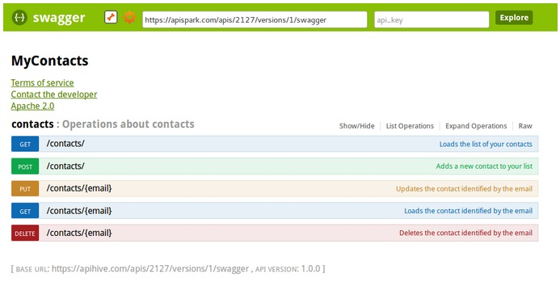

An important part of running a web API is documenting it so that consumers of your API can invoke it with ease.

APISpark is very flexible in this regard and provides three different ways to document you APIs that are hosted on APISpark:

* Make your API documentation public
* Download your API's documentation
* Get the Swagger definition of your API

APISpark will also provide automatic documentation for existing APIs that are not hosted by APISpark. In this case, please visit the section called [Document existing web APIs through APISpark Descriptors](technical-resources/apispark/guide/document/overview "Document existing web APIs through APISpark Descriptors").

# Make your API documentation public

If you want users to access your API documentation without authentication, you can make it public. Once made public, you can share the link to your API's **Overview** page or other public pages such as the **API Commons** tab.

To make your API documentation public:

Open your API **Overview** page.  
In the central panel, click on the **Overview** tab.  
Select the **Public documentation** checkbox.

# Download your API's documentation

APISpark provides a way for you to download documentation for web APIs. This way you can, for example, host the documentation on your own website. Documentation is provided for download in a number of different formats.

## Add new documentation for download

In order to be able to download documentation for your API, you need to first define the documentation you want to make available.

To do this, navigate to an API's **Overview**, open the **Downloads** tab, and click on the **Add** button next to the **Documentation** section in the left panel.

You will be prompted to select a **Name** and **Type** (format) for your new downloadable documentation.

Once the desired types of documentation have been added to the **Documentation** section, you will need to generate the downloads for your API.

## Download your documentation

To generate the downloads for an API, open the API's **Overview**, click on the pop-down action button and select **Generate downloads**.

Your documentation can now be downloaded from the **Documentation** section by selecting a type of documentation from the list and clicking on the **Download** button.

# Get the Swagger definition of your API

**Swagger** is an API description language that comes with a number of tools including Swagger UI. Swagger UI provides a nice HTML presentation of your API’s contract and allows you to test your API by calling it.

APISpark *automatically* produces a Swagger definition for APIs it hosts. You can share the Swagger definition's URL with your users, download the Swagger definition itself, and you can even view the definition via the Swagger User Interface.

The screenshot below is an example of what the Swagger UI looks like.  

For details on how to use swagger UI with your API, go to the [Standard API definition and third party integration](technical-resources/apispark/guide/publish/publish/api-definition "Standard API definition and third party integration") page.
