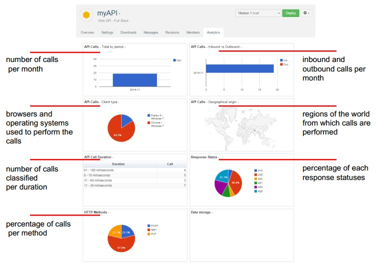

APISpark provides you with an Analytics page that gives you details on how your API is consumed.

From your API **Overview** page, click the **Analytics** tab.

<!---#Data storage coming soon or not
-->
