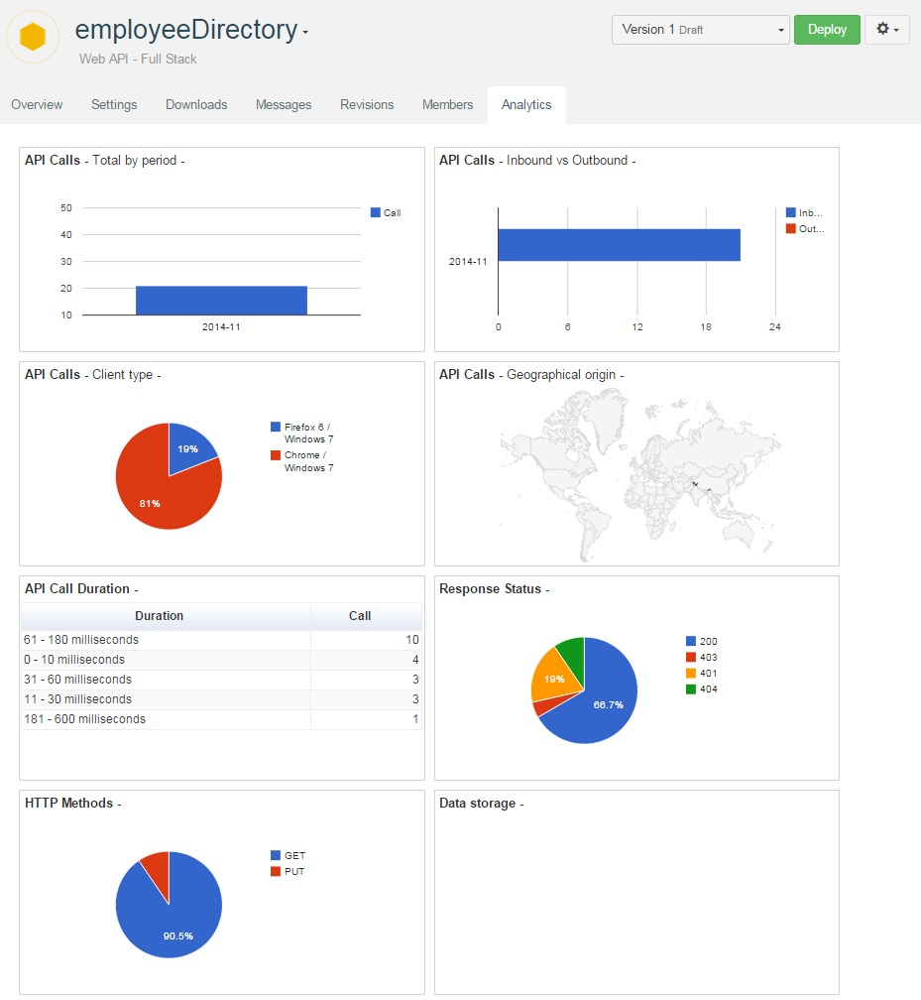

APISpark provides you with an Analytics page that gives you details on how your API is consumed.

From your API **Overview** page, click on the **Analytics** tab.

#API Calls

###Total by period
This diagram shows you the number of calls per month.
###Inbound vs outbound
This diagram shows you the amount of inbound and outbound calls per month.
###Client type
This diagram shows you on which browser and operating system the calls have been performed.
###Geographical origin
This map shows you from which regions of the world the calls to your API are performed.
###Duration
This table orders the calls by their duration and indicates the number of calls for each duration.

#Response status
This diagram shows you the different response statuses and the proportion for each status.

#HTTP methods
This diagram shows you the different HTTP methods used for your API calls and the proportion for each method.

<!---#Data storage
-->
