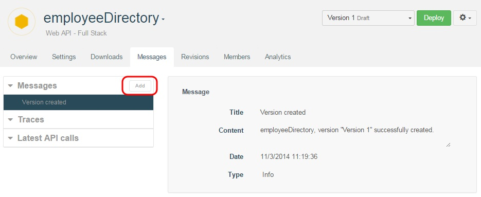
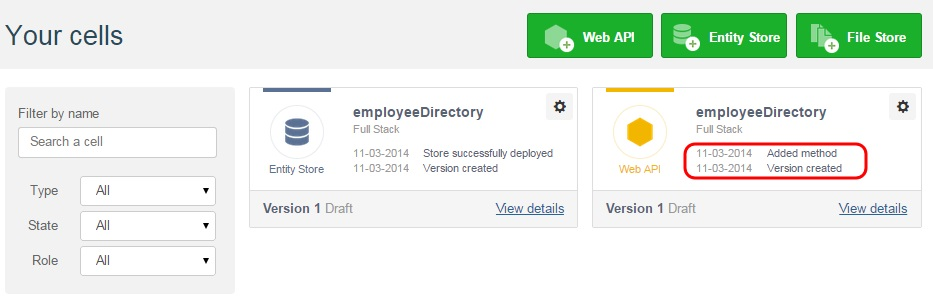

In order to inform your community, you can use the **Messages** feature.

1. From your API **Overview** page, click on the **Messages** tab.
2. In the **Messages** section, click on the **Add** button.

  

3. In the **Add message** window, enter a **Title**, **Content** and select a message **Type** (Info or Deployment).

  

The messages written display in the Dashboard cell cards.

