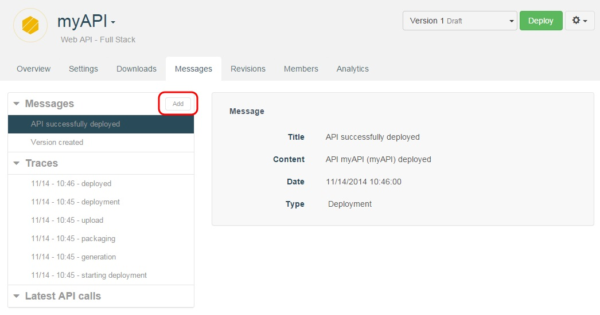
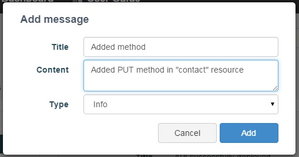
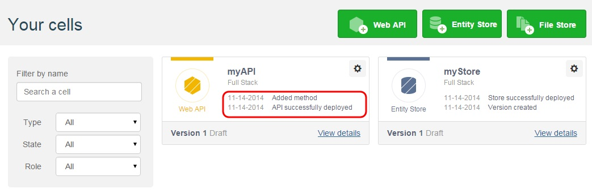

To keep your users and team members informed about your API, you edit messages from the API's **Messages** tab.

To create a new message, click on the **Add** button.

  

You will be prompted to enter a **Title**, **Content** and select a message **Type** (Info or Deployment).

  

A cell's most recent messages are displayed in its Dashboard cell card.

