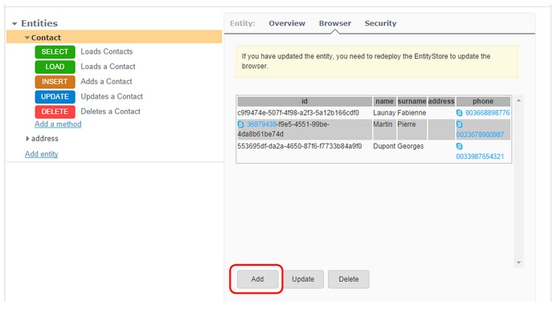

You can add entries manually in your Entities.

1. Click on the appropriate Entity in the **Entities** section.
2. Click on the **Browser** tab.
3. Click on the **Add** button to add a new entry.

	

4. Enter the data in the Add an entity window.

 > **Note:** You need to redeploy your Entity Store to update your Browser.
