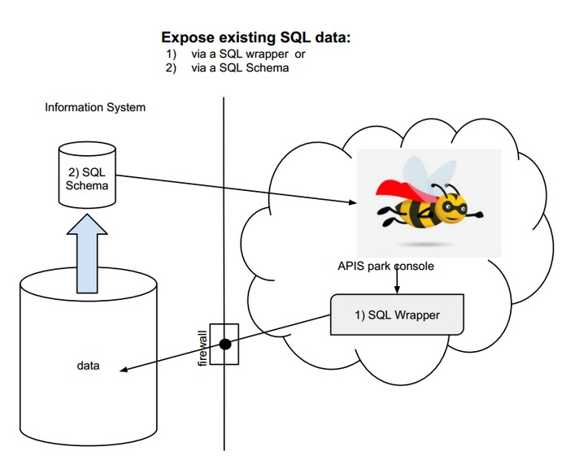

If you need your API to get data from your existing SQL database, your firewall may prevent APISpark from connecting to this database. To solve this secure access issue, you can extract a SQL Schema from your database and import it in APISpark. The databases (and tools) supported are PostgreSQL (pgAdmin, pg_dump), MySQL (Mysql Workbench, mysqldump) and ORACLE (SQL Developer).

For more information, jump to our [Import a SQL schema](apispark/tutorials/technical-tuto/import-sql-schema "Import a SQL schema tutorial") tutorial!
