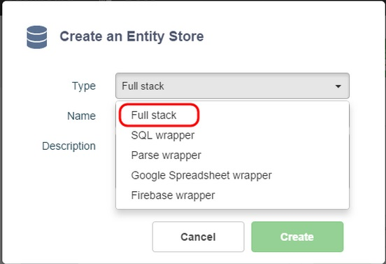
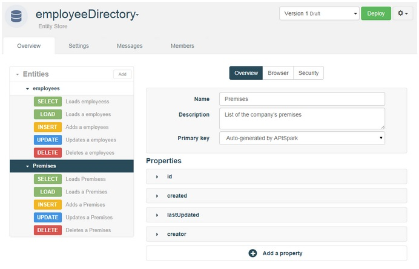
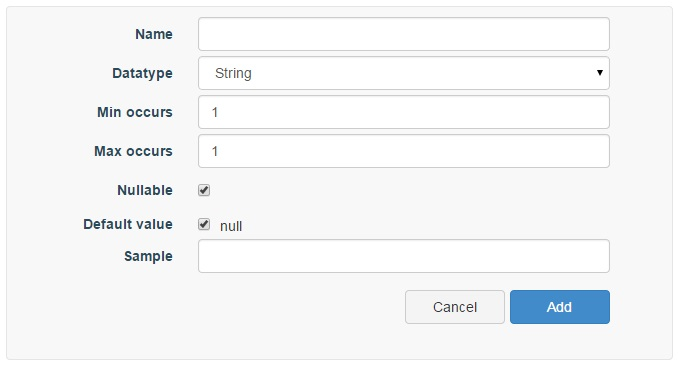

# Introduction

The Entity Store is APISpark's structured data store.  

An Entity Store provides the necessary tools to design a data model from the ground up. We will look at the Entity Store's data modeling features in the following sections.

# Create an Entity Store

Like all other cell types, Entity Stores are created and opened via the Dashboard. To create an Entity Store, go to the **Dashboard** and click on the **+ Entity Store** button.

In the **Create an Entity Store** window, select **Full Stack** in order to create an Entity Store hosted by APISpark.

Enter a **Name** (required) and a **Description** (optional) and click on the **Create** button.

# Data modeling

An Entity Store's data model is defined in the store's **Overview** tab.

An Entity Store is composed of entities, which represent types of objects and their properties. Entities can be linked together by defining special properties called relations.

## Create an entity
In the **Entities** section, click on the **Add** button.  
Give the new entity a name (required) and a description (optional).

## Entity configuration

Entities are listed in the **Entities** section on the left of the **Overview**.

Selecting an entity from the list opens the Overview. The Overview displays configuration information for the entity, and lists the entity's properties.

The entity's name and description can be updated from this screen.

### Primary key policy

A property called *id* is automatically added to every new entity. This property serves as the entity's primary key.

The Entity Store supports two different primary key policies.

#### Auto-generated

If the auto-generated primary key policy is selected, then the *id* property's name and type are immutable, and its value generated by APISpark everytime a new data element is inserted.

#### Specified at creation

You can rename the primary key property, and choose between two primitive data types: *String* and *Integer*. The value of a primary key is specified by the user in creation requests.

## Entity properties

Entities are composed of properties. An entity property has a number of different attributes that can be set.

To add a property to an Entity, click on **+ Add a property**.

You are then invited to specify the following **attributes** for the new property.

### Name

The property's name.

### Type

The property's type. There are two main categories of types: primitive and relations. We'll cover relations in the next section. All possible types for a property are listed in the **Datatype** drop-down menu.

The primitive types available in the Entity Store are *String*, *Integer*, *Date*, *Boolean*, *Double*, *Long*, and *Float*.

### Min occurs and Max occurs

These fields contain the minimum and maximum cardinalities of the property.

These values are used to determine if a property should be stored as a list.

By default, both min and max occurs are set to 1.

### Nullable

This checkbox allows you to make the property mandatory (not nullable) or not. Deselect the **Nullable** checkbox to make it mandatory.

### Default value

A property’s default value is assigned if a null value is provided upon creation of a data element. To assign a default value, deselect the **Default value** checkbox and enter a value in the field that displays.

### Sample

A sample value can be provided in this field. It will be suggested to the user when s/he adds a record.

## Entity relations

Practical data models usually require the definition of relations between entities.

APISpark supports one-to-many relations for this purpose.

To create a one-to-many relation, add a new **Property** to the entity on the unary side. From the **Type** drop-down, select the type of the entity at the n-ary side of the relation. Set minOccurs to '1' and maxOccurs to '*'.

You will then be able to load a data element at the unary side of the relation, and load all the associated elements at the n-ary side of the relation automatically. Please visit the [Invocation](technical-resources/apispark/guide/publish/publish/invocation "Invocation") page to learn how to retrieve your entities via a web API.

### Example

Suppose your application's data model includes Users that can post Comments. A User can post multiple Comments, and a Comment is related to a single author User. Thus, this is a typical one-to-many relation.

In order to build an Entity Store like this, create a User entity and a Comment entity. Add a property to entity User called "comments" that is of type Comment. Set minOccurs to '1' and maxOccurs to '*'.

When a User posts a new Comment, create a new Comment element. Update the corresponding User element's "comments" property by adding the ID of the newly created Comment to the list (comma seperated values).

When loading a User, you will be able to also load all the User's comments. Visit the [Invocation](technical-resources/apispark/guide/publish/publish/invocation "Invocation") page for more information on querying your data.

<!--
There are three types of relations available: association, aggregation, and composition.
-->

<!--
##### Association and aggregation relations

Currently, association and aggregation relations have the same semantics: they represent a reference to another object. In practice this means that one object will contain a reference to another object through knowledge of the referred object's primary key.

##### Composition relation

The particularity of the “composition” relation is that if entity A is “composed” by entity B, then deleting a data entry of type A will result in the deletion of the data entries of type B that compose it.
-->
