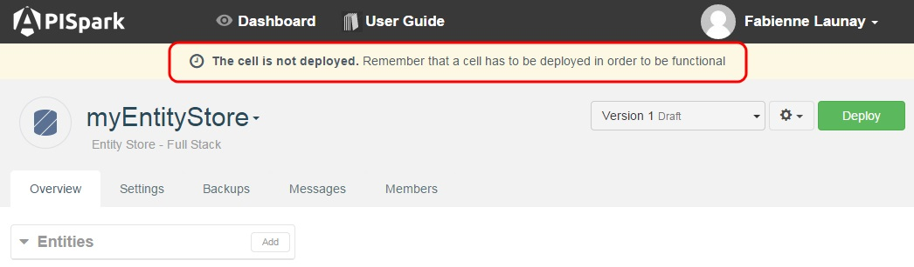

To deploy an Entity Store, simply click on the **Deploy** button. Messages will inform you of the progress and completion of the procedure.

You have to deploy your Entity Store before being able to use it: a message will remind you to deploy your Entity Store at creation.

**Warning**: if the Entity Store is in draft mode and has only one version, all data will be erased if the store is deployed.

> **Note:** If you add entities, you need to (re)deploy your Entity Store to display them in the **Browser** tab.

Once you have deployed your Entity Store, you can [Export an API](technical-resources/apispark/guide/create/overview "Export an API").
