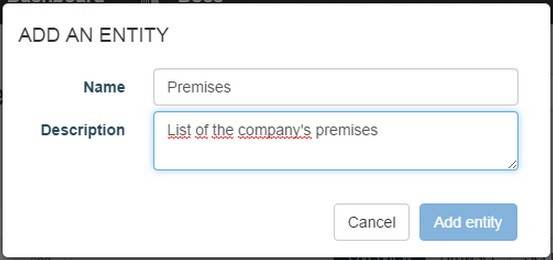

# Introduction

The Entity Store is APISpark's structured data store.  

An Entity Store provides the necessary tools to design a data model from the ground up. We will look at the Entity Store's data modeling features in the following sections.

# Create an Entity Store

Like all other cell types, Entity Stores are created and opened via the Dashboard. To create an Entity Store, go to the **Dashboard** and click on the **+ Entity Store** button.

In the **Create an Entity Store** window, select **Full Stack** in order to create an Entity Store hosted by APISpark.

Enter a **Name** (required) and a **Description** (optional) and click on the **Create** button.

# Data modeling

An Entity Store's data model is defined in the store's **Overview** tab.

An Entity Store is composed of entities, which represent types of objects and their properties. Entities can be linked together by defining special properties called relations.

## Create an entity
In the **Entities** section, click on the **Add** button.  
Give the new entity a name (required) and a description (optional).

## Entity configuration

Entities are listed in the **Entities** section on the left of the **Overview**.

Selecting an entity from the list opens the Overview. The Overview displays configuration information for the entity, and lists the entity's properties.

The entity's name and description can be updated from this screen.

### Primary key policy

A property called *id* is automatically added to every new entity. This property serves as the entity's primary key.

The Entity Store supports two different primary key policies.

#### Auto-generated

If the auto-generated primary key policy is selected, then the *id* property's name and type are immutable, and its value generated by APISpark everytime a new data element is inserted.

#### Specified at creation

You can rename the primary key property, and choose between two primitive data types: *String* and *Integer*. The value of a primary key is specified by the user in creation requests.

## Entity properties

Entities are composed of properties. An entity property has a number of different attributes that can be set.

To add a property to an Entity, click on **+ Add a property**.

Your are then invited to specify the following attributes for the new property:

### Name

The property's name.

### Type

The property's type. There are two main categories of types: primitive and complex. All possible types for a property are listed in the **Datatype** drop-down menu.

#### Primitive types

The primitive types available in the Entity Store are *String*, *Integer*, *Date*, *Boolean*, *Double*, *Long*, and *Float*.

#### Complex types (relations)

The type of a property can be that of an entity in the Entity Store. In this case, the property is considered to be a relation to another entity type.

There are three types of relations available: association, aggregation, and composition.

##### Association and aggregation relations

Currently, association and aggregation relations have the same semantics: they represent a reference to another object. In practice this means that one object will contain a reference to another object through knowledge of the referred object's primary key.

##### Composition relation

The particularity of the “composition” relation is that if entity A is “composed” by entity B, then deleting a data entry of type A will result in the deletion of the data entries of type B that compose it.

### Min occurs and Max occurs

These fields contain the minimum and maximum cardinalities of the property.

These values are used to determine if a property should be stored as a list.

Furthermore, the cardinality constraints are enforced on real data at runtime.

By default, both min and max occurs are set to 1.

### Default value (optional)

A property’s default value is assigned if a null value is provided upon entity creation.
