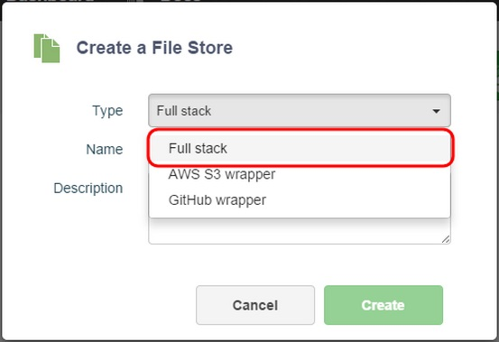
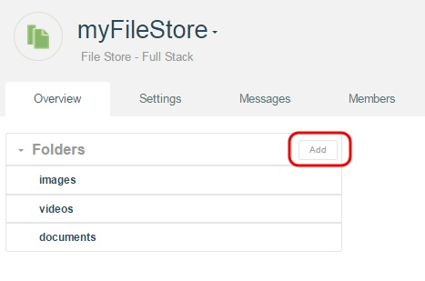
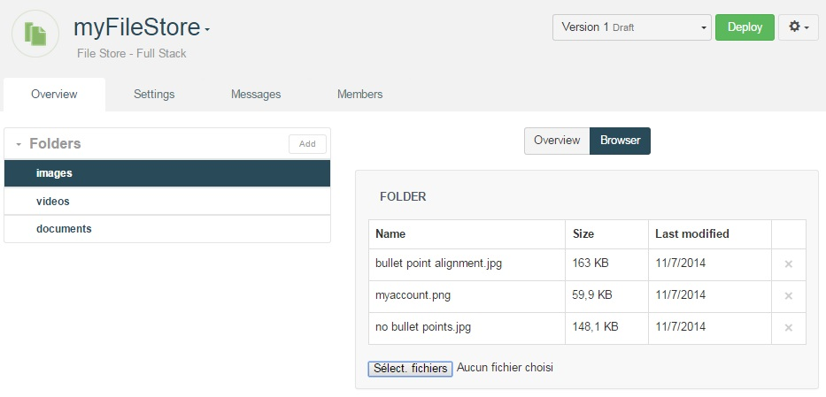

# Introduction

APISpark features two types of File Store implementations: *local* and *wrapper*.

In this section we will cover the full stack File Store (local), with which static files can be stored on the APISpark platform.

# Create a File Store

To create a File Store from the **Dashboard**, click on the **+ File Store** button.

  

In the **Create a File Store** window, select **Full Stack** in order to choose the *local* File Store implementation (as opposed to a *wrapper*).

  

Enter a **Name** and an optional **Description** and click on the **Create** button.

# Create folders

To create a new folder, click on the **Add** button from the File Store **Overview** tab.

  

# Deploy a File Store

To deploy a File Store, click on the **Deploy** button. Messages will inform you of the progress and completion of the process.

Once you have deployed your File Store, you can [Export an API](technical-resources/apispark/guide/store/entity-stores/overview "Export an API").

# Upload files

The data browser is a useful tool that lets you directly modify the contents of a folder in a File Store.

In order to use the data browser, the File Store must be deployed.

To upload a file, select the desired Folder from the **Folders** section, and  click on the **Browser** tab.

  

Upload a file from your file system.

 > **Note:** If you add or modify existing folders, you will need to re-deploy your File Store in order for the Browser to update itself.
