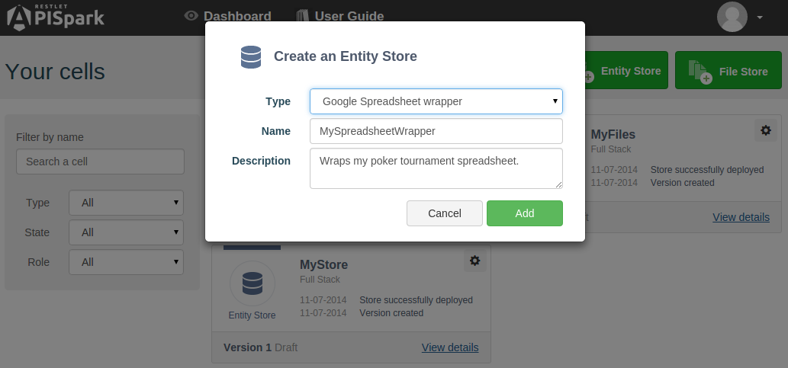

# Introduction

APISpark Data Stores can wrap external data sources so that you can leverage the data they contain by means of the APISpark platform.

These special Data Stores are called **Wrappers**.

APISpark supports a number of external data sources for both Entity Stores (structured data) and File Stores (static files).

To create a **Wrapper** Entity Store, go to your **Dashboard** and click on the **+ Entity Store** button.

Select the type of external data source you would like to wrap from the **Type** pop-down menu.

Each wrapper has its own simple configuration procedure.

For details on how to setup each wrapper, please navigate to the appropriate subsection below.

# Supported wrappers

## Google Spreadsheet Wrapper

<a href="https://docs.google.com/spreadsheets/" target="_blan">Google Spreadsheet</a> is a collaborative data editing tool that belongs to the Google Docs suite.

The **Google Spreadsheet Wrapper** Entity Store lets you wrap your spreadsheets to APISpark in the form of structured entities. You are then free to expose these entities via web APIs.

For more information jump to our [Turn a Google Spreadsheet into a web API](technical-resources/apispark/tutorials/api-for-publishers/turn-spreadsheet-to-api "Turn a Google Spreadsheet into a web API") tutorial.

## SQL database Wrapper

SQL is a language for defining and manipulating data structures stored in relation databases.

The **SQL Wrapper** Entity Store lets you wrap an SQL database to APISpark in the form of structured entities. You are then free to expose these entities via web APIs.

For more information jump to our [Expose an SQL database via a web API](technical-resources/apispark/tutorials/api-for-publishers/expose-sql-via-api "Expose an SQL database via a web API") tutorial.

## Parse Wrapper

<a href="https://parse.com/" target="_blank">Parse</a> is a mobile Backend-as-a-Service (MBaaS) provider that focuses on building and hosting simple backends for mobile applications.

The **Parse** Entity Store lets you wrap a Parse backend to APISpark in the form of structured entities. You are then free to expose these entities via web APIs.

## Firebase Wrapper

<a href="https://firebase.com/" target="_blank">Firebase</a> is a Backend-as-a-Service (BaaS) with a focus on real-time structured data.

The **Firebase** Entity Store lets you wrap a Firebase backend to APISpark in the form of structured entities. You are then free to expose these entities via web APIs.

## Amazon Wrapper

<a href="http://aws.amazon.com/fr/s3/" target="_blank">AWS S3</a> is a file storage service provided by Amazon.

The **S3** File Store lets you wrap AWS S3 buckets to an APISpark File Store. You are then free to expose these files via web APIs.

For more information jump to our [AWS S3 example](technical-resources/apispark/guide/store/wrappers/aws "AWS S3 example section") page.
