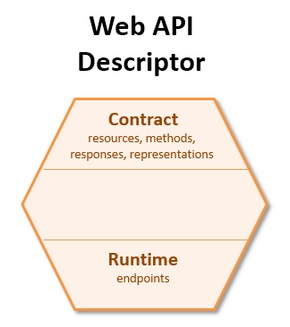
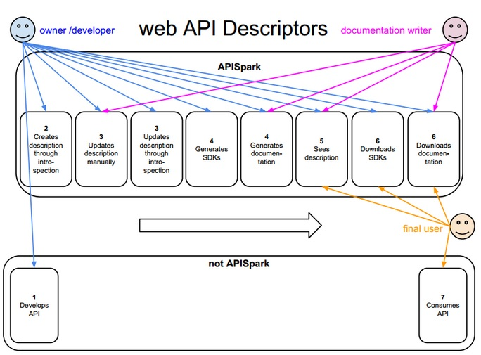
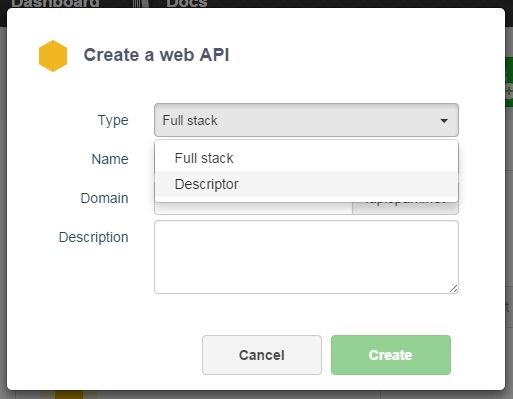
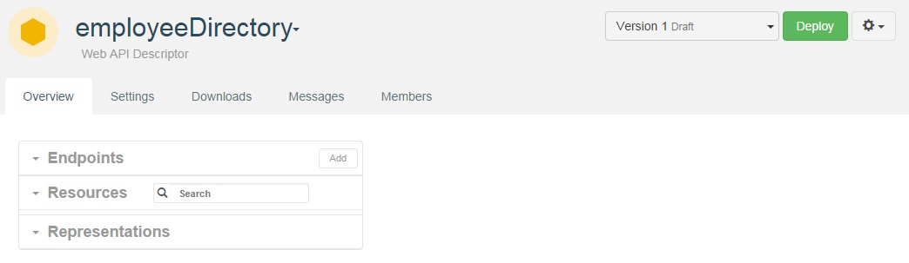

#Definition
A Web API Descriptor documents a Web API. You may create a web API descriptor by introspecting existing code (Restlet framework, JAX_RS) or import an existing web API definition (the Swagger format is supported as of October 2014).

An APISpark Descriptor can be automatically translated to Swagger or RAML format. Displaying and updating a descriptor should be possible for developers and documentation writers as the descriptor is created but only visible for users when it is published.

<!-- TODO center -->

#Benefits
APISpark Descriptors feature saves substantial time.   
Here are some of the benefits of using APISpark Descriptors:  

- Your documentation is automatically generated.  
- You are provided with client SDKs and server skeletons which avoids you repetitive and non qualitative work that often leads to bugs.  
- You are also provided with analytics, firewall and user management features which are included  

#Operational description
Here is the process described to document an existing API with the Descriptor feature:

1. Develop web API (without APISpark)
2. Create descriptor via introspection
3. Update descriptor by hand or via introspection
4. Generate  documentation + SDKs
5. Download documentation + SDKs
6. Consume web API (outside APISpark)

<!-- TODO center -->

#Create a Descriptor

1. From APISpark **Dashboard**, click on the **+Web API** button.

	

2. In the **Create a web API** window, select the **Descriptor Type** and give a **Name** to your Descriptor.

	

	Your API Descriptor displays.

	
