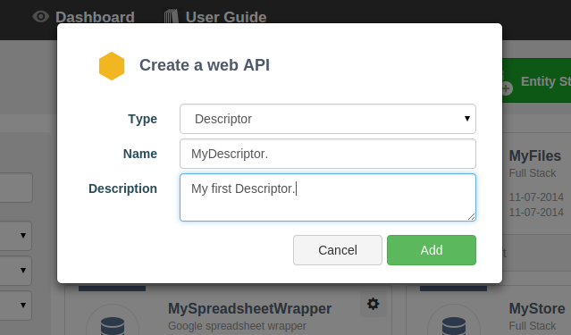

The Descriptor is a type of web API cell.

To create a Descriptor, go to the **Dashboard** and click on the **+Web API** button.

In the **Create a web API** window, select **Descriptor** from the **Type** pop-down menu. You will be prompted to give your Descriptor a **Name** and a **Description** (optional).

A **Descriptor** is composed of **Endpoints**, **Resources**, and **Representations**.

You can edit your Descriptor manually in order to define the structure of an API. From this structure, you will be able to generate documentation and client-side and server-side code from the Descriptor's **Downloads** tab.  

