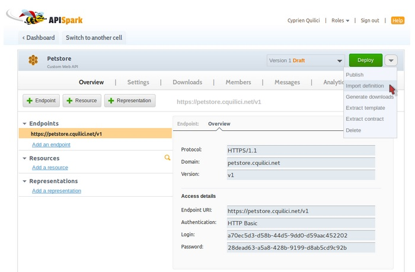
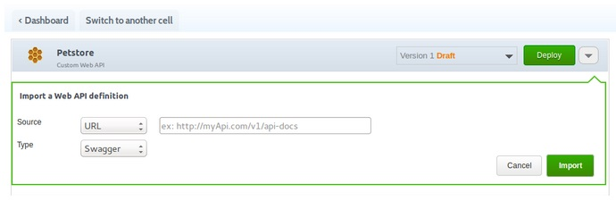
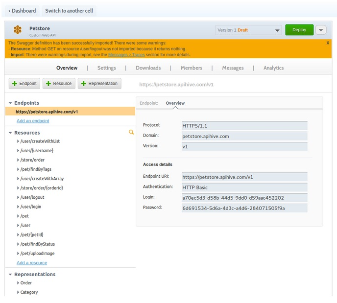
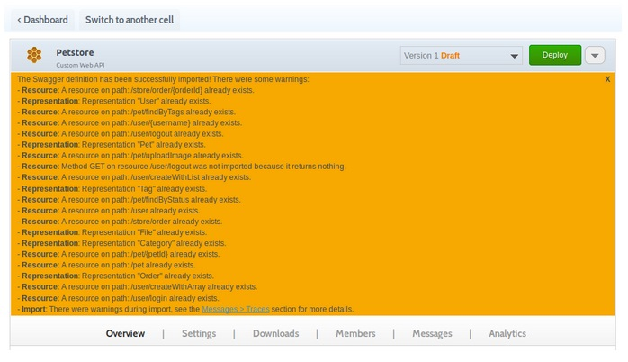

# Import a Swagger definition

For more information jump to our [Manage an existing web API from its Swagger documentation](apispark/tutorials/api-for-vendors/manage-api-with-swagger "Manage an existing web API from its Swagger documentation") tutorial.

## Import existing Swagger definitions

You can import a web API’s contract to APISpark using its Swagger definition by providing the URL on which it is available to APISpark.

1. From an existing API page, click on the actions arrow on top right of your screen and select **Import definition**.

  

2. In the **Import a Web API definition** window, fill in the different fields to import the representations and resources of a Swagger definition into your API.

  

3. Click on the **Import** button. The representations and resources of the Swagger definition you provided the link to are imported in your **Overview** tab.

  

 >**Note:** If you import several definitions you may have conflicts, multiple resources on the same path or multiple representations with the same name. The import wizard will display a message in an orange panel and you will be free to solve the conflicts by yourself.

 >**Note:** If you close the panel, you can still find the traces in the Messages tab, in the Traces section of the left pane.

# Introspect a Restlet Framework code

For more information jump to our [Document an existing Restlet web API](apispark/tutorials/api-for-vendors/document-restlet-api "Document an existing Restlet web API") tutorial.

After introspecting your Restlet Framework code, you can work on your [Descriptor](technical-resources/apispark/guide/document/edit-descriptor "Descriptor").

# Introspect a JAX-RS code

For more information jump to our [Document an existing JAX-RS web API](apispark/tutorials/api-for-vendors/document-jax-rs-api "Document an existing JAX-RS web API") tutorial.

After introspecting your JAX-RS code, you can work on your [Descriptor](technical-resources/apispark/guide/document/edit-descriptor "Descriptor").
