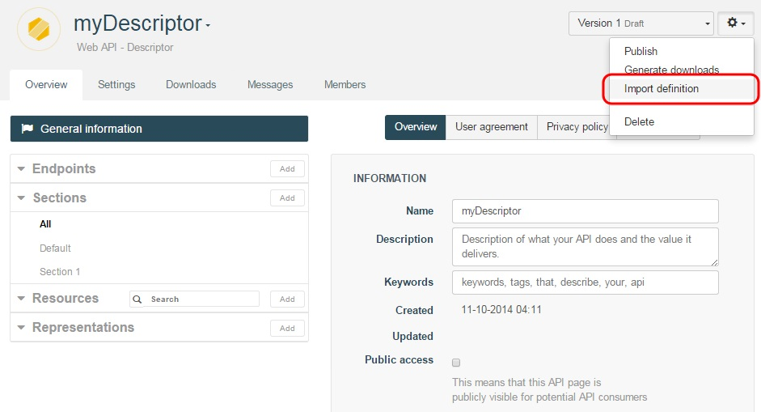

Rather than manually create a **Descriptor** from scratch, APISpark provides ways for you to automatically generate one that describes your existing API.

A **Descriptor** can be generated from your current API's Swagger definition, or from your API's Restlet Framework or Jax-RS implementation.

# Generate a Descriptor from a Swagger definition

You can generate a web API Descriptor by importing a Swagger definiton for an existing web API, by provider the Swagger definition's URL.

Open an existing Descriptor or create a new one from the Dashboard by clicking on **+ Web API** and selecting **Descriptor** from the pop-down menu.

From the Descriptor's **Overview**, click on the actions button on the top right of your screen and select **Import definition** from the menu.

  

You will be prompted to enter the URL that points to
your API's Swagger definition.

Click on the **Import** button to import the Swagger definition into your Descriptor. As a result, representations and resources will be added to your Descriptor according to the content of the Swagger definition.

To view the changes, navigate to the Descriptor's **Overview** tab.

> **Note:** Importing several Swagger definitions to the same Descriptor could result in naming conflicts for resource paths or representations. The import wizard will indicate which conflicts need to be resolved.

# Generate a Descriptor with Restlet's code Introspector

The Restlet code introspector is designed to generate a web API Descriptor by introspecting the code of your existing web API implementation.

The introspector supports two types of Java implementations: those based on the Restlet Framework, and those based on JAX-RS.

For more information on how to introspect a Restlet Framework application, jump to our [Document an existing Restlet web API](apispark/tutorials/api-for-vendors/document-restlet-api "Document an existing Restlet web API") tutorial.

For more information on how to instrospect a JAX-RS application, jump to our [Document an existing JAX-RS web API](apispark/tutorials/api-for-vendors/document-jax-rs-api "Document an existing JAX-RS web API") tutorial.

After introspecting your JAX-RS code, you can work on your [Descriptor](technical-resources/apispark/guide/document/edit-descriptor "Descriptor").
