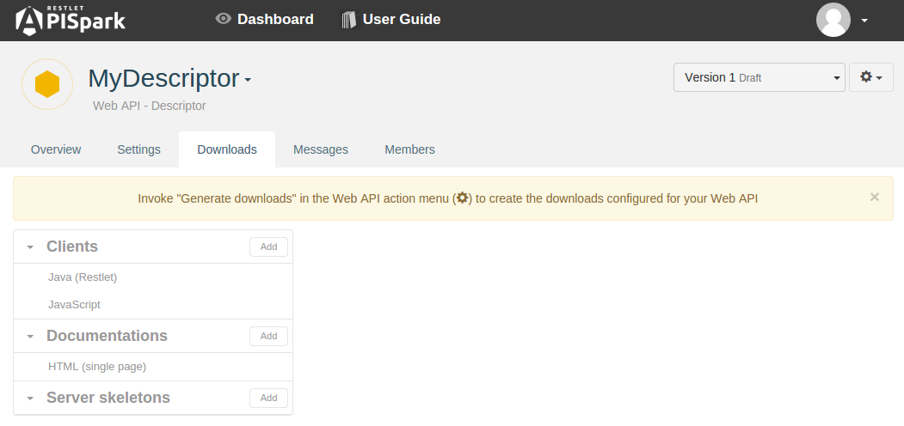

Once you have completed your **Descriptor** cell, you can get your web API documentation and share it with your team or make it public.

# Document your web API

For details on how to get the documentation of your cell, go to the [Documentation page](technical-resources/apispark/guide/publish/publish/documentation "Documentation page") of the **Publish** section.

# Generate client SDKs

As for a [web API](technical-resources/apispark/guide/create/overview "web API") cell, you could [Generate and download client SDKs](technical-resources/apispark/guide/publish/publish/client-sdk "Generate and download client SDKs") from your **Descriptor**.

# Third-party integration

With **APISpark**, you could download the API definition in standard formats like **RAML** or **Swagger**. Go to the [Third-party Integration](technical-resources/apispark/guide/publish/publish/third-party "Third-party Integration") page for more details.
