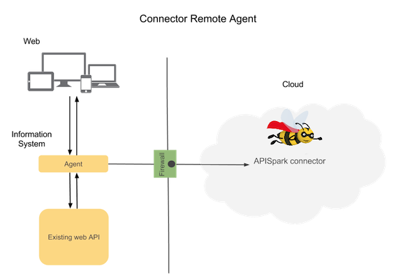

APISpark can bring additional features to your existing web API, hosted outside of APISpark, with the **Connector** cell.

With a **Connector**, you can add to your API:
* Authenticated access
* Fine-grained Access Control
* Rate-limitation (quotas) to your API users
* IP filtering

# How connector works?

To enable these features, you should add an APISpark Remote Agent on front of your API.

This agent acts as a Reverse Proxy and add wanted features on incoming requests.

The agent is a standalone application and exists also as a Restlet Framework Service to use it embedded in a Restlet Framework application.

<!-- TODO add download link and restlet framework guide link -->

# Agent settings

The features used by the **Remote Agent** are defined on your APISpark dashboard, on the **Connector** cell.

An API connector is composed of:

 * an API configuration controlled by APISpark
 * a Remote Agent running that retrieves the configuration from APISpark, manages the actual/raw API and sends back usage data to APISpark
the actual “raw” API that is hosted by our customer and provides the actual service

The first section is actually giving read-only information (including the “Usage mode” and “IP address”) about the Remote Agent
I think we need to adjust the section title accordingly, maybe “Remote Agent Details” or just “Remote Agent”

The second section is actually giving control on which overall API management features are provided to the actual/raw API by the Connector
I think we need to adjust the section title accordingly, maybe “API Management Features” or just “Features”
