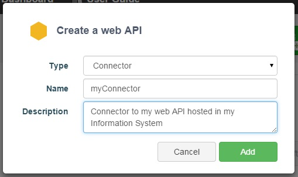

APISpark can bring additional features to your existing web API hosted outside of APISpark with the *Connector* cell.

# Enhanced your web API

With a *Connector*, you can add to your API:
* Authenticated access
* Fine-grained access control
* Rate-limitation (quotas) to your API users
* IP filtering

# How does a connector work?

To enable these features, you should add an APISpark Remote Agent in front of your API.

This agent acts as a Reverse Proxy and adds the features you have enabled in the APISpark console on the incoming requests of your API.

# Create a Connector cell

To create a Connector, go to the **Dashboard** and click on the **+Web API** button.

In the **Create a web API** window, select **Connector** from the **Type** drop-down menu. You will be prompted to give your Connector a **Name** and a **Description** (optional).

A Connector has the same properties as a [web API](technical-resources/apispark/guide/create/overview "Web API") except that a connector is not hosted by the APISpark plateform.

With a Connector you can also document your web API as with a [Descriptor](technical-resources/apispark/guide/document/overview "Descriptor").

Once you have created a Connector, you can [configure it and install the Remote Agent](technical-resources/apispark/guide/manage/remote-agent "Remote Agent") in your Information System, and that's all. Your web API has new features inside without writing a line of code!
