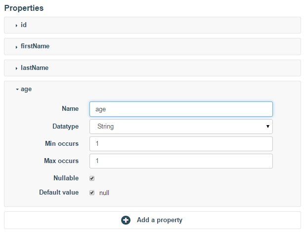
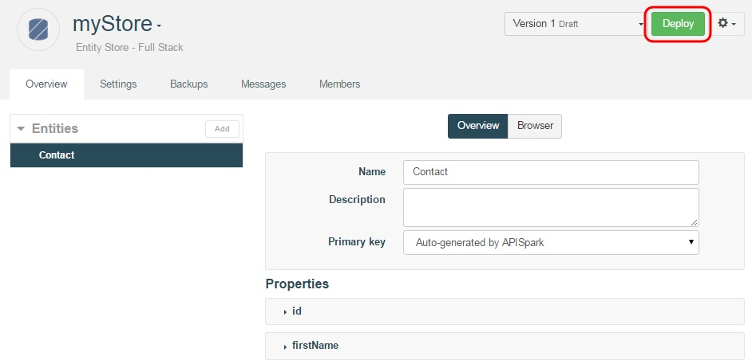
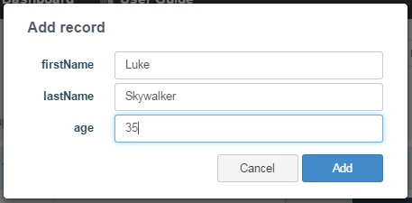
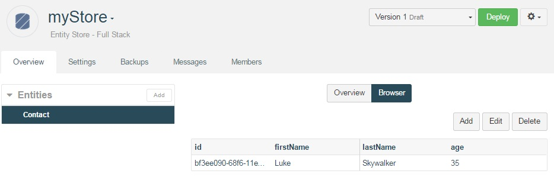
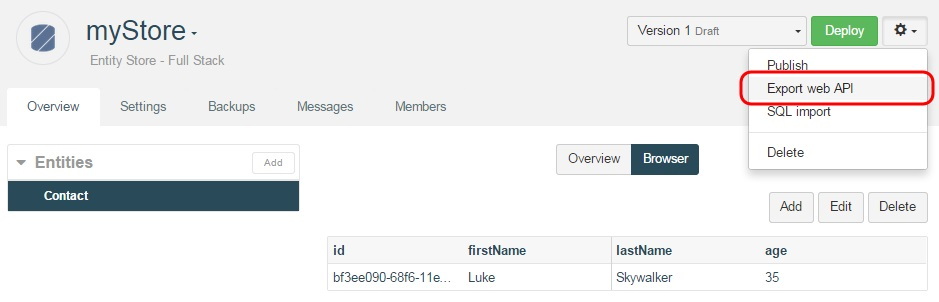
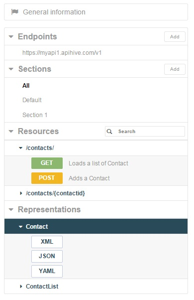
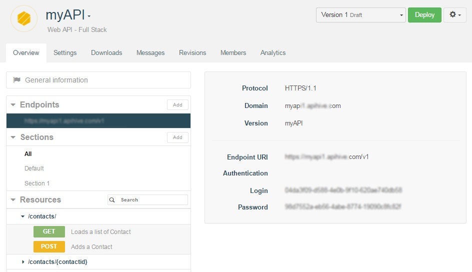
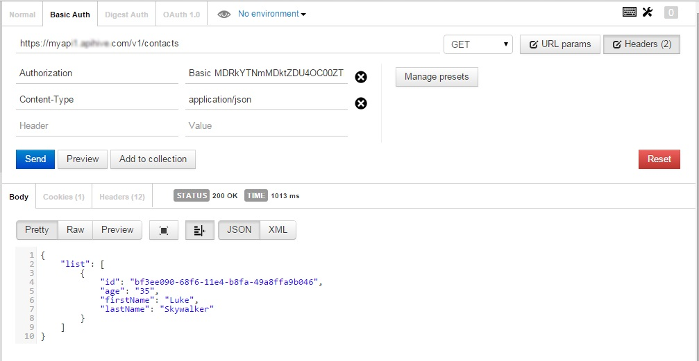

# Introduction

This tutorial will show you how to deploy your first API in 15 minutes or less. Head to our [User guide](technical-resources/apispark/guide "User guide") page first if you would like to learn about the different concepts within the platform. Now, let’s get right to it.

# Requirements

To follow this tutorial, you will need the following:

*   a web browser,
*   15 minutes of your time.

# 1. Deploy the Data Store

[Sign in](https://apispark.com/signin) to your APISpark account or go back to your **Dashboard**.

Click on **+ Entity Store**, choose **Full stack** and name it **myStore**.

Click on the **Add** button.

You will be taken to the **EntityStore** Overview page.

From the **Entities** section, Click on the **Add** button and name it **Contact**.

Click on **+ Add a property** to create three properties named *lastName*, *firstName* and *age*. Note that several properties were created automatically as well.

You can choose to define the data type, cardinality and default value.

Click on the **Deploy** button to deploy your Entity Store.

You can now add contacts. For the purpose of this tutorial, let’s add one manually.

Click on your **Contact** entity.

Click on the **Browser** tab in the central panel. (The **Browser** will only be visible if you have deployed your Entity Store. If it does not appear, try refreshing the page).

Click on the **Add** button.

Fill in the fields.

Click on the **Add** button. Your first contact should be displayed like so:

# 2. Deploy the web API

Remaining on the Entity Store’s page, click on the actions button to the right of the **Deploy** button.

Enter a name for your API (e.g. myAPI).

The domain will be created automatically but may not be available anymore so make sure to adjust it.

Click **Add**. You will be taken to the API’s **Overview** page.

The screenshot below shows some of the drop down menus opened to give you an idea of how it is organized.

Deploy the API by clicking the **Deploy** button.

The API should now be accessible online. To reach it, use the subdomain of apispark.net that you chose when you created the API.

As you can see, the credentials required to invoke the API can be found in the **Overview** tab, by clicking on the relevant **Endpoint**. You will need to copy the **Endpoint URI**, **Login** and **Password** information for the next step.

# 3. Invoke the web API

Using a web API does not impose any particular programming language. It can even be done from a web browser. However, to test your API we recommend the use of tools such as the Chrome extensions [POSTMAN](https://chrome.google.com/webstore/detail/postman-rest-client/fdmmgilgnpjigdojojpjoooidkmcomcm?utm_source=chrome-ntp-icon) and [DHC](http://sprintapi.com/dhcs.html) that provide a graphical user interface to perform HTTP calls. The following figure shows the call to the Contacts API with POSTMAN.

When using POSTMAN, click on the **Basic Auth** tab, fill in the **Username** and **Password** fields with the information copied from your APISpark **Endpoint**. Fill in the **Endpoint URI** and add **/contacts/** at the end of it.

To retrieve the list of contacts in JSON, click the **Headers** button on the far right and input the **Accept** command in the **Header** field and write **application/json** in the **Value** field opposite.

Click the **Send** button.

The following figure shows the API call in POSTMAN.

>**Note:** APISpark can also generate custom Client SDKs for different environments such as Java, Android, GWT and JavaScript (AJAX or Node.js). More environments will be supported in the future.

Congratulations on completing this tutorial! If you have questions or suggestions, feel free to contact the [Help Desk](http://support.apispark.com/).
