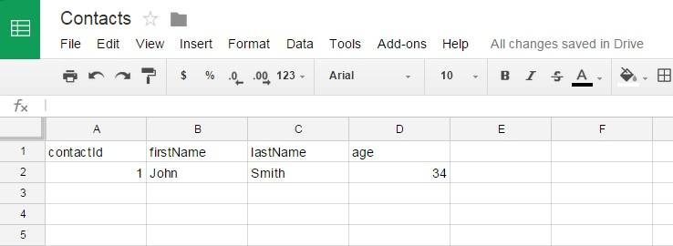
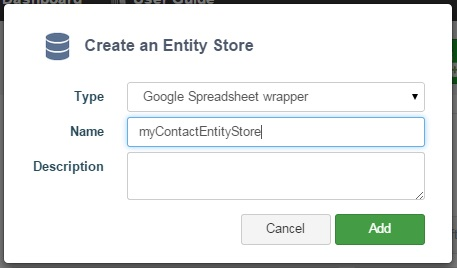
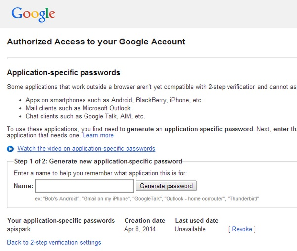
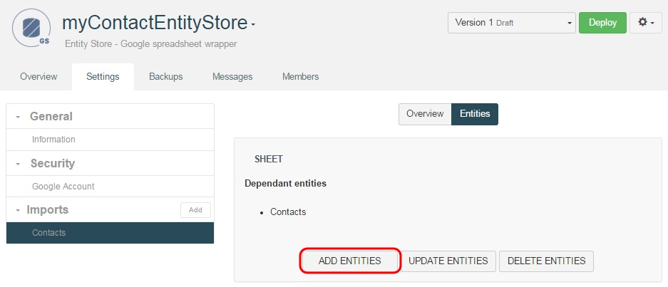
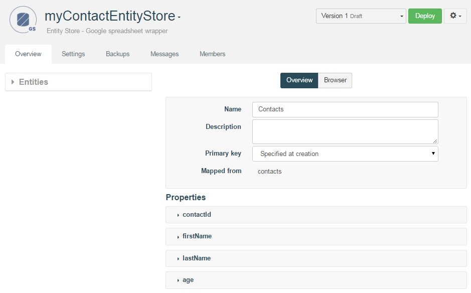
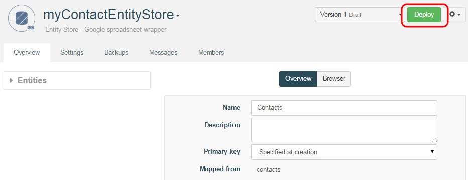
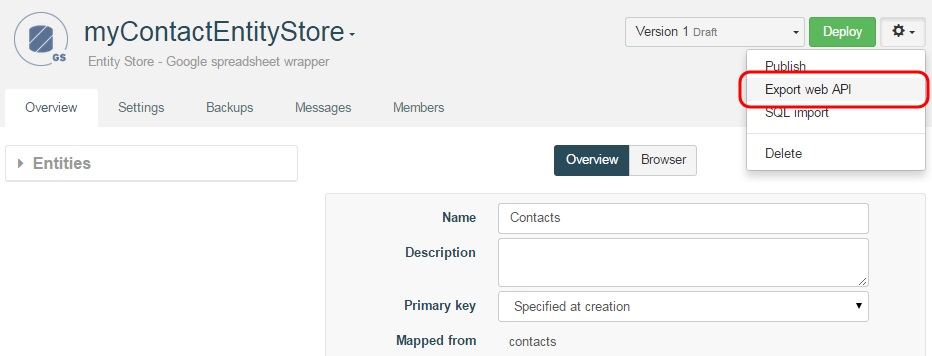
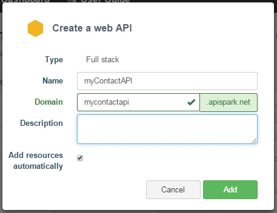

# Introduction

This tutorial will show you how to create a custom web API that gives access to existing data stored in a Google Spreasheet. [Google Spreadsheet](http://docs.google.com/) is a popular collaborative data editing tool within the Google Docs suite.

# Requirements

To follow this tutorial, you will need:

*   a web browser,
*   20 minutes of your time,
*   a Google Account application-specific password.

# 1. Prepare the Google Spreadsheet

Sign in to your **Google Drive** account.

In this tutorial example, we have a spreadsheet with a worksheet named **Contacts** with the following columns, containing a list of contacts:

*   **contact_id** : primary key
*   **lastName** (string) : last name
*   **firstName** (string) : first name
*   **age** (integer) : age

Add a **Contact** so that you can retrieve it later when performing an HTTP call to your API.
We've chosen to name ours John Smith, 34 years old.

# 2. Configure the Entity Store Wrapper

Sign in to your **APISpark** account.

Click on **+ Entity Store**.

Select **Google Spreadsheet wrapper** and enter a name for your store e.g. myContactEntityStore. Input a description if you wish.

Click **Add**. You will be taken to the **Entity Store** Overview page.

Click on the **Settings** tab.

In the **Security** section, click on **Google Account**.

>**Note:** Please do not overlook the next step, it is important to ensure your wrapper will work properly throughout the creation and deployment of your API.

Open a new tab on your browser.

Head to your **Google Account Settings** [**<u>Security</u>**](https://www.google.com/settings/security?hl=en) page and check that **2-step authentication is activated**. If **2-step authentication** is not activated, you need to activate it before proceeding.

Once activated, go back to the [**<u>Security</u>**](https://www.google.com/settings/security?hl=en) page, click on **Settings** near **App Passwords** and generate a new application-specific password for APISpark. You will use it as your **Client Secret**.

Go back to APISpark and input your **Client ID** (your email) and the **Client Secret** you just created (email address and password).

>**Note:** we are working to leverage Google OAuth authentication to remove the need to access your Google Account.

Click on the **Test** button, to ensure the connection between APISpark and your Google Account is well configured.

When connected, in the **Imports** section, click on **Add** button and APISpark will automatically detect all spreadsheets on your account.

Select the sheet to import and click **Import sheet**.

In the **Imports** section, you can click on the sheet which opens the **Overview** tab. It displays hints about the sheet.

Click the **Entities** tab.

Click the **Add entities** button to create the associated folders.

One entity will be created for each worksheet using the **Add entities** button.

In this case, a **Contacts** entity was automatically created. The first line of the worksheet is used to determine the properties of the entity to add. The corresponding mappings for the entity and its fields are also automatically created.

Click on the **Deploy** button.

When your Entity Store has been deployed, you can export it as a new web API.

# 3. Deploy the Web API

Remaining on the **Entity Store**'s page, click on the actions button on the right of the **Deploy** button and select **Export web API**.

Name it **myContactAPI**.

The domain will be created automatically but may not be available anymore so make sure to adjust it.

Click **Add**. You will be taken to the API's **Overview** page.

Deploy the API by clicking the **Deploy** button.

The API should now be accessible online. To reach it, use the subdomain of apispark.net that you chose when you created the API.

As you can see, the credentials required to invoke the API can be found in the **Overview** tab, by clicking on the relevant **Endpoint**.
You will need to copy the **Endpoint URI**, **Login** and **Password** information for the next step.

# 4. Invoke the web API

Using a web API does not impose any particular programming language.
It can even be done from a web browser. However, to test your API we recommend the use of tools such as the Chrome extensions [<u>POSTMAN</u>](https://chrome.google.com/webstore/detail/postman-rest-client/fdmmgilgnpjigdojojpjoooidkmcomcm?utm_source=chrome-ntp-icon) and [<u>DHC</u>](http://sprintapi.com/dhcs.html) that provide a graphical user interface to perform HTTP calls. The following figure shows the call to the Contacts API with POSTMAN.

When using POSTMAN, click on the **Basic Auth** tab, fill in the **Username** and **Password** fields with the information copied from your APISpark **Endpoint**.
Fill in the **Endpoint URI** and add **/contacts/** at the end of it.

To retrieve the list of contacts in JSON, click the **Headers** button on the far right and input the **Accept** command in the **Header** field and write **application/json** in the **Value** field opposite.

Click the **Send** button.

The following figure shows the API call in POSTMAN.

Note that any POST requests made to the API will result in new data being created in your Google Spreadsheet. Likewise, any data manually inserted via the Google Spreadsheet is visible via the custom web API.

**Did you know?**

APISpark can also generate custom Client SDKs for different environments such as Java, Android, GWT and JavaScript (AJAX or Node.js). More environments will be supported in the future.

Congratulations on completing this tutorial! If you have questions or suggestions, feel free to contact the [Help Desk](http://support.apispark.com/).
