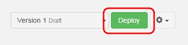

# Introduction

This tutorial will show you how to create a custom web API that exposes data stored in a Google Spreasheet. <a href="
http://docs.google.com/" target="_blank">Google Spreadsheet</a> is a popular collaborative data editing tool within the Google Docs suite.

# Requirements

To follow this tutorial, you will need:

*   a web browser,
*   20 minutes of your time,
*   a Google Account application-specific password.

# 1. Prepare a Google Spreadsheet

Sign in to your **Google Drive** account.

In this tutorial example, we have a spreadsheet with a worksheet named **Contacts** with the following columns, containing a list of contacts:

*   **contactid** : primary key
*   **firstname** (string) : first name
*   **lastname** (string) : last name
*   **age** (integer) : age

> **Note:** we recommend using lowercase characters from the roman alphabet only for column names.

Add a **Contact** so that you can retrieve it later when performing an HTTP call to your API.
We have chosen to name ours Darth Vador, 46 years old.

# 2. Configure the Google Spreadsheet Wrapper

Sign in to your **APISpark** account.

Click on **+ Entity Store**.

Select **Google Spreadsheet wrapper** and enter a name for your store . We named ours "mySpreadsheet". Input a description if you like.

Click **Add** to create the Wrapper. You will be taken to the Wrapper's **Overview** page.

# 3. Setup a Google application-specific password

From your new Wrapper's **Overview**, click on the **Settings** tab.

In the **Security** section, click on **Google Account**.

>**Note:** Please do not overlook the next step, it is important to ensure your wrapper will work properly throughout the creation and deployment of your API.

Open a new tab in your browser.

Head to your **Google Account Settings** <a href="
https://www.google.com/settings/security?hl=en" target="_blank">**Security**</a> page and check that **2-step authentication is activated**. If **2-step authentication** is not activated, you need to activate it before proceeding.

Once activated, go back to the <a href="
https://www.google.com/settings/security?hl=en" target="_blank">**Security**</a> page, click on **Settings** near **App Passwords** and generate a new application-specific password for APISpark. You will use it as your **Client Secret**.

Back on APISpark, in the **Google Account** combo of your Wrapper's **Security** section, input your **Client ID** (your email address) and the **Client Secret** you just created.

Click on the **Test** button, to ensure the connection between APISpark and your Google Account is well configured.

# 4. Import a Spreadsheet

From the **Imports** section in the left panel, click on the **Add** button.

Select a spreadsheet to import and click on **Import sheet**.

The selected spreadsheet's **Overview** tab should open in the central panel.

# 5. Import entities

Select a spreadsheet from the **Imports** section in the left panel.

Click on the **Entities** tab in the central panel.

Click on the **Add entities** button to create entities based on the structure of the spreadsheet.

One entity will be created for each worksheet.

In this case, a **Contacts** entity was automatically created. Entity properties are created based on the names of the columns in the first row of a worksheet.

Go back to the Wrapper's **Overview** tab to view the new entities.

Deploy the Spreadsheet Wrapper by clicking on the **Deploy** button.

# 6. Export a Web API from the Wrapper

From the Wrapper's **Overview** page, click on the actions button on the right of the **Deploy** button and select **Export web API**.

Give your new API a name. We named ours **myAPI**.

The domain will be created automatically but may not be available anymore so make sure to adjust it.

Click on **Add** to create the API. You will be taken to the API's **Overview** page.

Deploy the API by clicking the **Deploy** button.

# 8. Invoke the web API

Using a web API does not impose any particular programming language.
It can even be done from a web browser. However, to test your API we recommend the use of tools such as the Chrome extensions
<a href="
https://chrome.google.com/webstore/detail/postman-rest-client/fdmmgilgnpjigdojojpjoooidkmcomcm?utm_source=chrome-ntp-icon" target="_blank">POSTMAN</a> and <a href="
http://sprintapi.com/dhcs.html" target="_blank">DHC</a> that provide a graphical user interface to perform HTTP calls. The following figure shows the call to the Contacts API with POSTMAN.

The credentials required to invoke the API can be found in the **Overview** tab, by clicking on the relevant **Endpoint**.
You will need to copy the **Endpoint URI**, **Login** and **Password**.

When using POSTMAN, click on the **Basic Auth** tab, fill in the **Username** and **Password** fields with the information copied from your APISpark **Endpoint**.

Fill in the **Endpoint URI** and add **/contacts/** at the end of it.

To retrieve the list of contacts in JSON, click the **Headers** button on the far right and input the **Accept** command in the **Header** field and write **application/json** in the **Value** field opposite.

Click the **Send** button.

The following figure shows the API call in POSTMAN.

Note that any POST requests made to the API will result in new data being created in your Google Spreadsheet. Likewise, any data manually inserted via the Google Spreadsheet is visible via the custom web API.

>**Note:** APISpark lets you generate custom Client SDKs for you API. Supported environments include Java, Android, GWT and JavaScript (AJAX or Node.js).

Congratulations on completing this tutorial! If you have questions or suggestions, feel free to contact the <a href="http://support.restlet.com/" target="_blank">Help Desk</a>.
